# Architecture

This page describes the system architecture of ui-test-rs, including component relationships, data flows, and design decisions.

## System Overview

ui-test-rs follows a layered architecture with five main components that work together to provide UI testing capabilities through Playwright MCP integration.

### High-Level Architecture

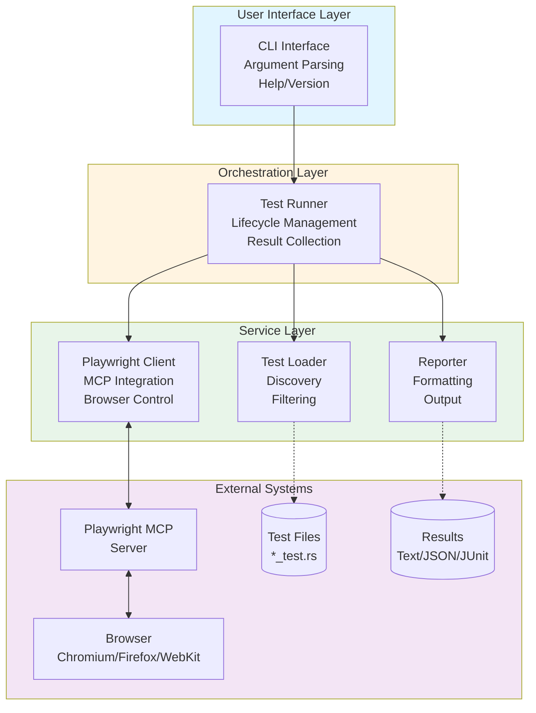

## Component Architecture

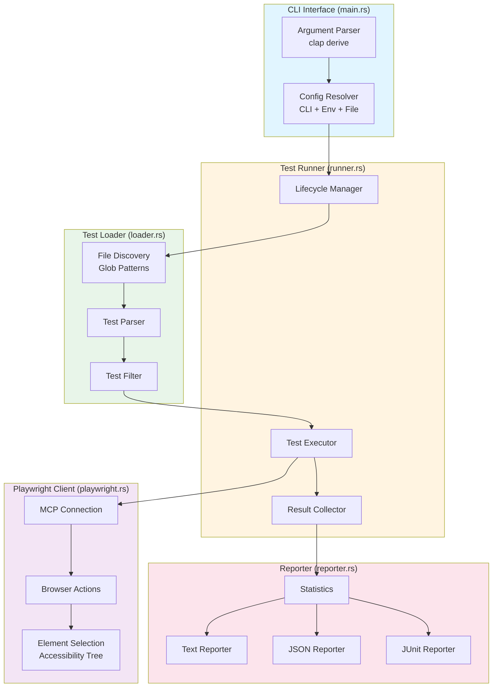

## Data Flow Architecture

### Configuration Flow

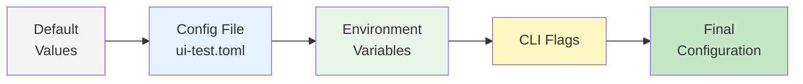

### Test Execution Flow

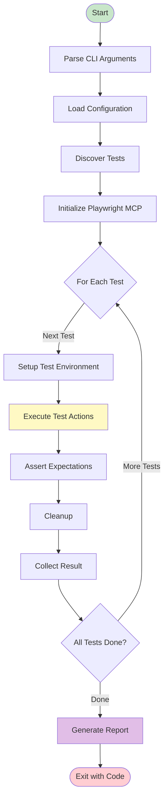

## Component Relationships

### Dependency Graph

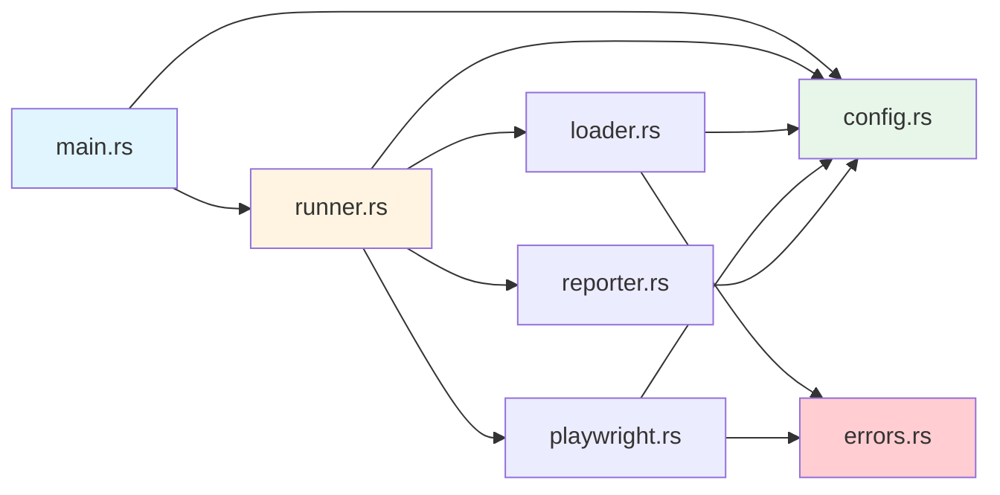

## Design Principles

### Layered Architecture Benefits

1. **Separation of Concerns**
   - Each layer has a specific responsibility
   - Changes in one layer minimally impact others
   - Easy to test components in isolation

2. **Dependency Flow**
   - Dependencies flow downward (user interface -> services -> external)
   - No circular dependencies
   - Clean interfaces between layers

3. **Extensibility**
   - New reporters can be added without changing core logic
   - Browser actions can be extended independently
   - Test discovery patterns can evolve separately

### Component Isolation

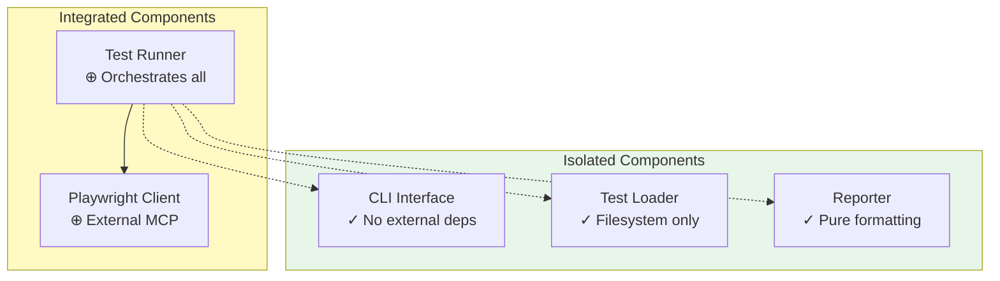

## Error Handling Architecture

### Error Propagation

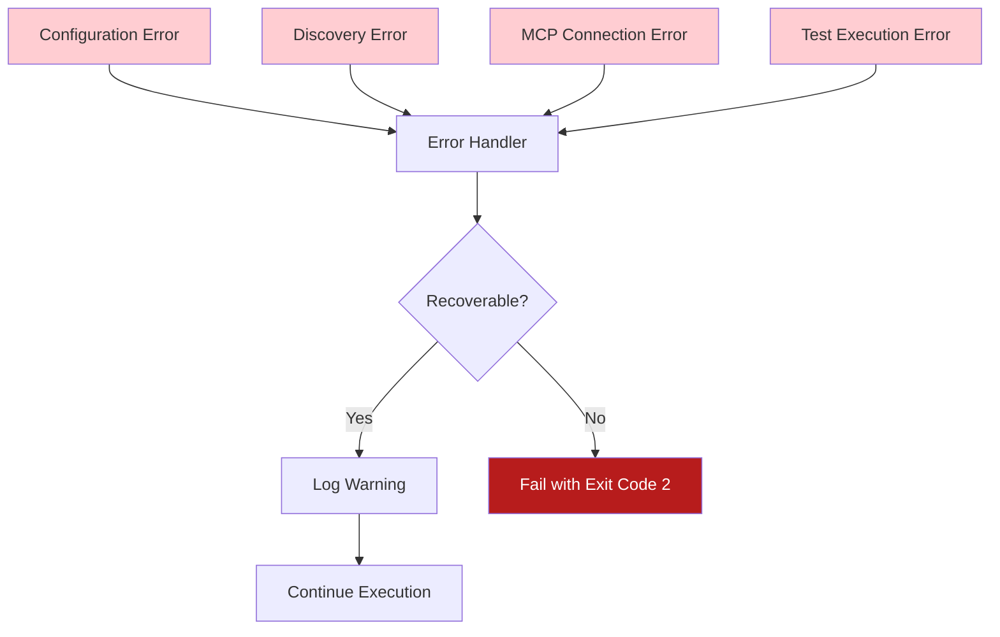

### Error Types Hierarchy

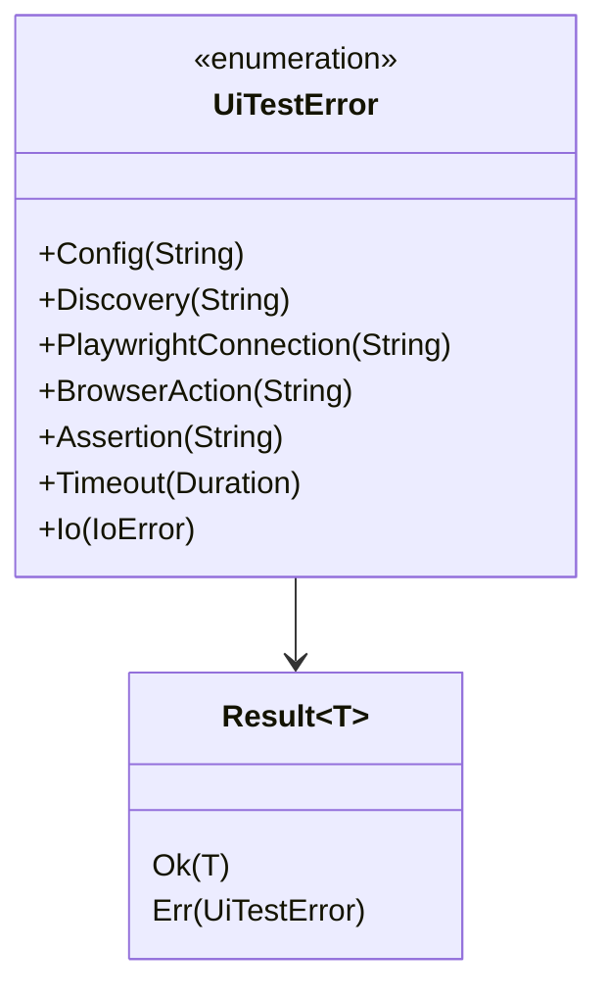

## Performance Architecture

### Parallel Execution Model

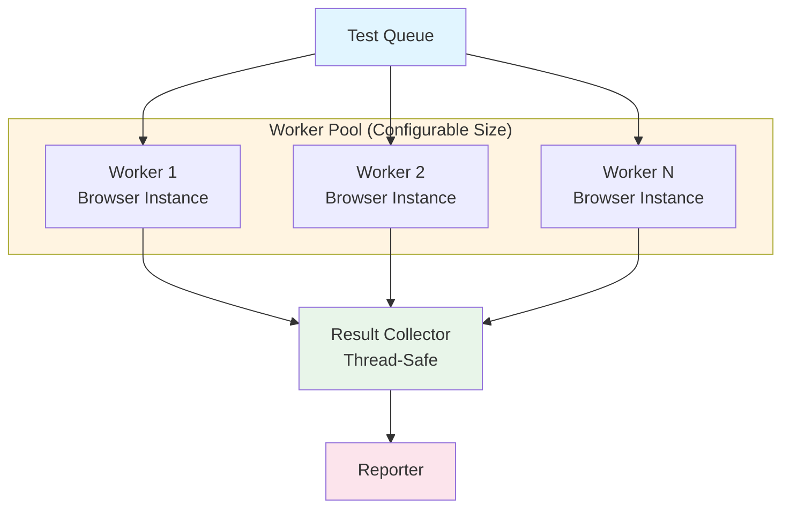

### Resource Management

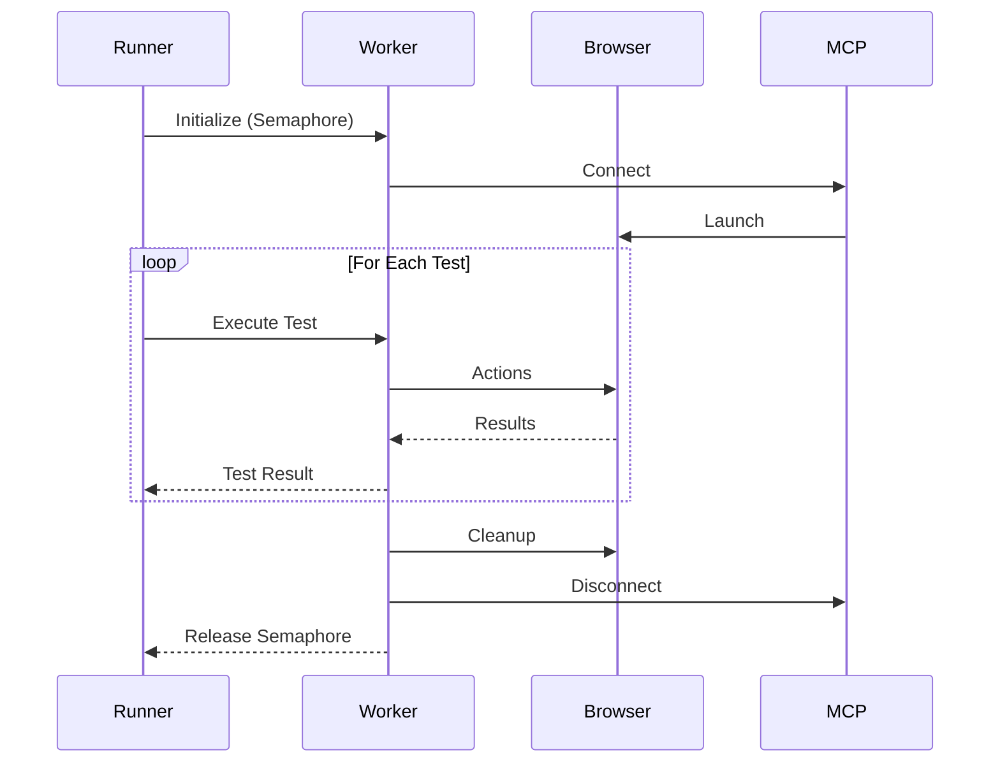

## Security Architecture

### Sandboxing Model

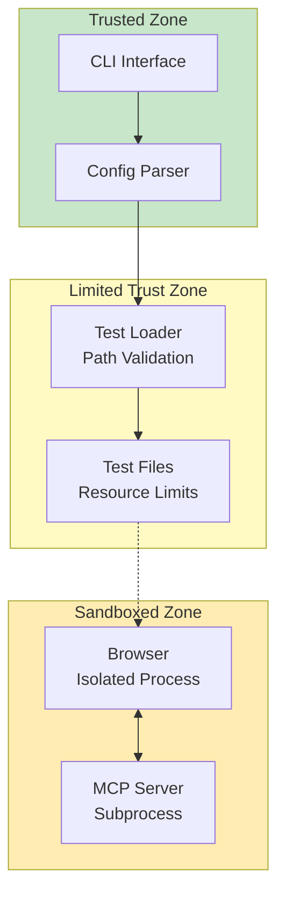

## Technology Stack

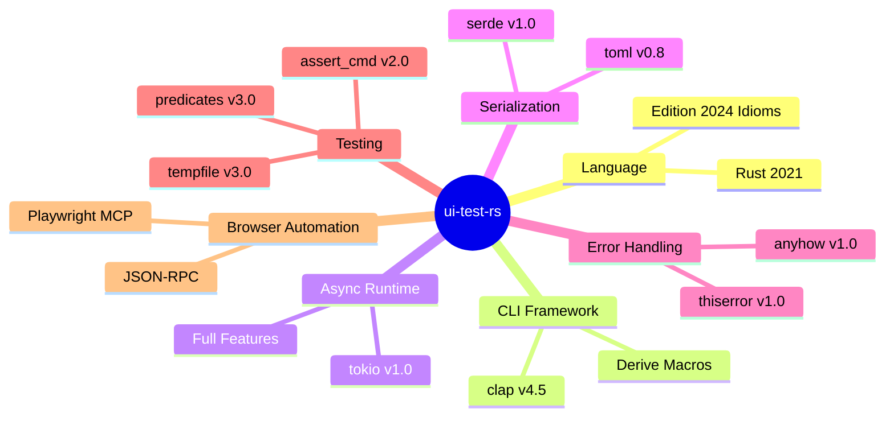

## Deployment Architecture

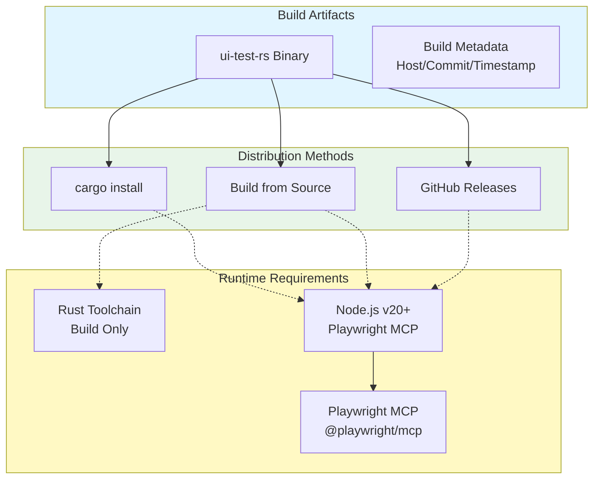

## Future Architecture Enhancements

### Plugin System (Planned)

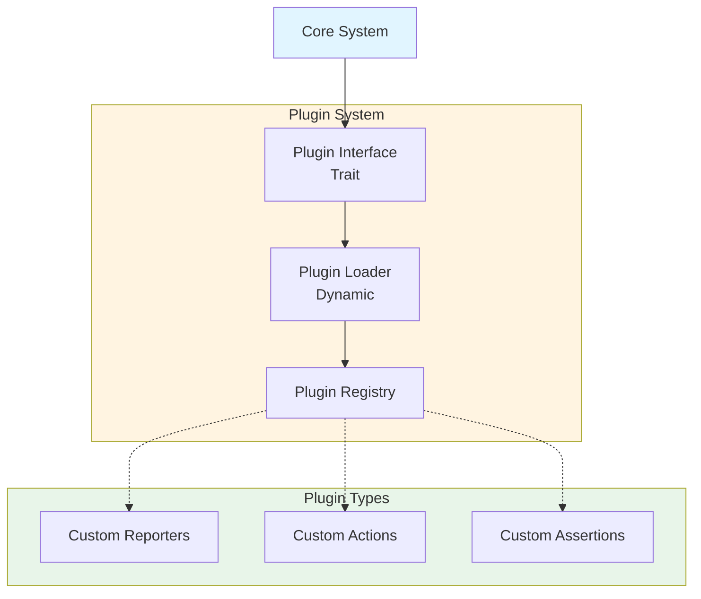

## Related Documentation

- [Sequences](Sequences) - Detailed flow diagrams and sequence diagrams
- [Configuration](Configuration) - Configuration system details
- [CLI Interface](CLI-Interface) - CLI component details
- [Test Runner](Test-Runner) - Runner component details
- [Playwright Client](Playwright-Client) - Browser automation details

---

**Last Updated:** 2025-11-18
