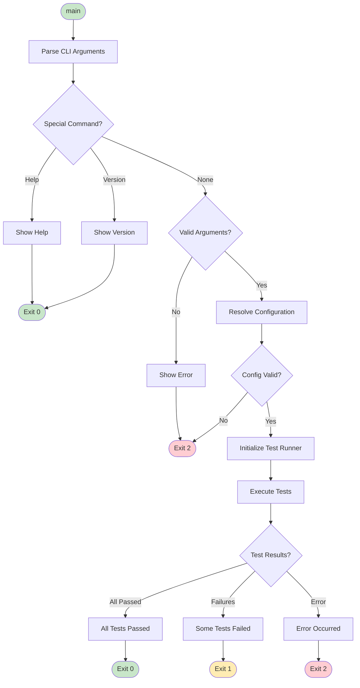

# CLI Interface

The CLI Interface component (`main.rs`) is the entry point of ui-test-rs, responsible for parsing command-line arguments, displaying help/version information, and initiating the test execution process.

## Overview


## Responsibilities

- Parse command-line arguments using clap
- Validate user input
- Display help and version information
- Resolve final configuration
- Initialize and invoke test runner
- Handle exit codes

## Structure

### Cli Struct

```rust
#[derive(Parser)]
#[command(
    name = "ui-test-rs",
    version,
    about = "CLI tool for UI testing with Playwright MCP integration",
    long_about = None,
    after_help = AI_INSTRUCTIONS,
)]
struct Cli {
    /// Path to test file or directory
    #[arg(default_value = ".")]
    test_path: PathBuf,

    /// Enable verbose output
    #[arg(short, long)]
    verbose: bool,

    /// Dry-run mode (preview without executing)
    #[arg(short = 'n', long)]
    dry_run: bool,

    /// Output format: text, json, junit
    #[arg(long, default_value = "text")]
    format: OutputFormat,

    /// Configuration file path
    #[arg(short, long)]
    config: Option<PathBuf>,

    /// Filter tests by name pattern
    #[arg(long)]
    filter: Option<String>,

    /// Number of parallel test workers
    #[arg(short = 'j', long, default_value = "1")]
    jobs: usize,
}
```

### Component Diagram


## Argument Parsing

### Parsing Flow


### Supported Arguments

| Argument | Type | Default | Required | Description |
|----------|------|---------|----------|-------------|
| `TEST_PATH` | Path | `.` | No | Path to test file or directory |
| `-v, --verbose` | Flag | `false` | No | Enable verbose output |
| `-n, --dry-run` | Flag | `false` | No | Preview without executing |
| `--format` | Enum | `text` | No | Output format (text/json/junit) |
| `-c, --config` | Path | - | No | Custom config file path |
| `--filter` | String | - | No | Filter tests by name pattern |
| `-j, --jobs` | Number | `1` | No | Number of parallel workers |
| `-h, --help` | Flag | - | No | Show help message |
| `-V, --version` | Flag | - | No | Show version information |

## Help Output

### Short Help (-h)

```
CLI tool for UI testing with Playwright MCP integration

Usage: ui-test-rs [OPTIONS] [TEST_PATH]

Arguments:
  [TEST_PATH]  Path to test file or directory to run [default: .]

Options:
  -v, --verbose           Enable verbose output
  -n, --dry-run           Dry-run mode (preview without executing)
      --format <FORMAT>   Output format: text, json, junit [default: text]
  -c, --config <FILE>     Configuration file path
      --filter <PATTERN>  Filter tests by name pattern
  -j, --jobs <JOBS>       Number of parallel test workers [default: 1]
  -h, --help              Print help
  -V, --version           Print version
```

### Extended Help (--help)

Includes the short help plus:
- Detailed descriptions of each option
- Examples of common usage patterns
- AI Coding Agent Instructions section
- Link to repository and documentation

### AI Coding Agent Instructions

```
AI CODING AGENT INSTRUCTIONS:

This tool runs UI tests using Playwright MCP for browser automation.

USAGE FOR AI AGENTS:
  1. Basic test execution:
     $ ui-test-rs tests/
     Exit code 0 = all passed, 1 = failures, 2 = error

  2. Verbose output for debugging:
     $ ui-test-rs -v tests/login_test.rs

  3. JSON output for parsing:
     $ ui-test-rs --format json tests/ > results.json

  4. Dry-run to preview:
     $ ui-test-rs --dry-run tests/

INTEGRATION:
  - Use in CI/CD with --format junit for test reporting
  - Combine with --filter for subset testing
  - Use --jobs for parallel execution

EXIT CODES:
  0 - All tests passed
  1 - Some tests failed
  2 - Error (config, discovery, MCP connection, etc.)

For more information:
https://github.com/softwarewrighter/ui-test-rs
```

## Version Output

### Short Version (-V)

```
ui-test-rs 0.1.0
```

### Extended Version (--version)

```
ui-test-rs 0.1.0

Copyright (c) 2025 Michael A Wright
License: MIT (https://opensource.org/licenses/MIT)
Repository: https://github.com/softwarewrighter/ui-test-rs
```

## Main Function Flow



## Exit Codes


## Input Validation

### Validation Rules


## Usage Examples

### Basic Usage

```bash
# Run all tests in current directory
ui-test-rs

# Run tests in specific directory
ui-test-rs tests/

# Run specific test file
ui-test-rs tests/login_test.rs
```

### With Options

```bash
# Verbose output
ui-test-rs -v tests/

# Dry-run mode
ui-test-rs --dry-run tests/

# JSON output
ui-test-rs --format json tests/ > results.json

# Parallel execution with 4 workers
ui-test-rs -j 4 tests/

# Filter tests by name
ui-test-rs --filter login tests/
```

### Combined Options

```bash
# Verbose, parallel, filtered
ui-test-rs -v -j 8 --filter "smoke" tests/

# Custom config, JUnit output
ui-test-rs -c custom.toml --format junit tests/
```

## Error Messages

### Examples

```
Error: Test path not found: tests/nonexistent

Error: Configuration file not found: custom.toml

Error: Number of jobs must be greater than 0

Error: Invalid output format: xml
  Supported formats: text, json, junit
```

## Standards Compliance

The CLI Interface must comply with `sw-checklist` validation:

### Required Standards

1. **Help Output**
   - Short help (`-h`) must be concise and single-screen
   - Extended help (`--help`) must include AI instructions

2. **Version Output**
   - Short version (`-V`) shows version number only
   - Extended version (`--version`) includes copyright and license

3. **Exit Codes**
   - `0` for success
   - `1` for test failures
   - `2` for errors

4. **Error Messages**
   - Clear and actionable
   - Include context
   - Suggest fixes when possible

## Related Documentation

- [Configuration](Configuration) - Configuration system
- [Test Runner](Test-Runner) - Test execution
- [Architecture](Architecture) - System architecture

---

**Last Updated:** 2025-11-18
