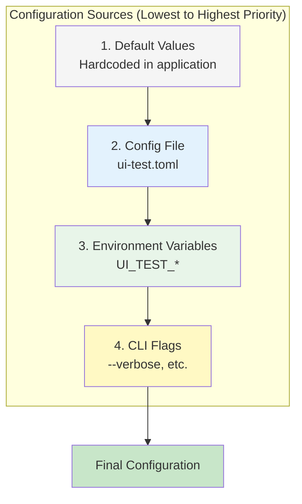
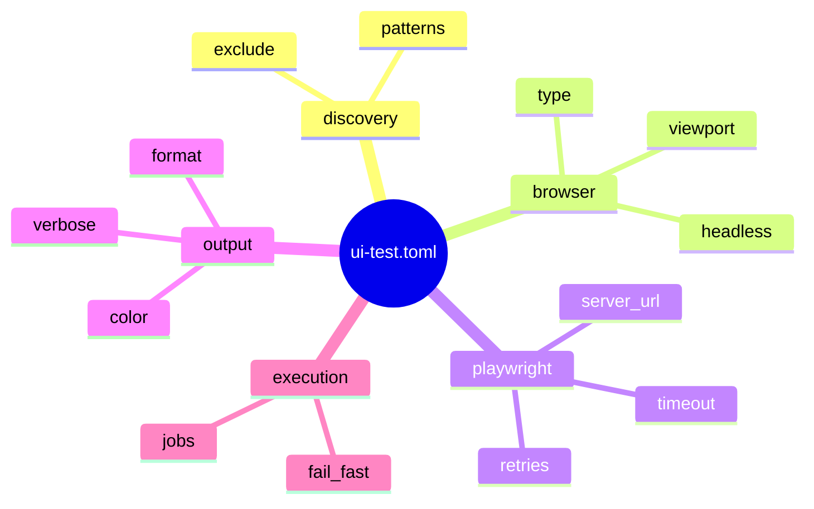
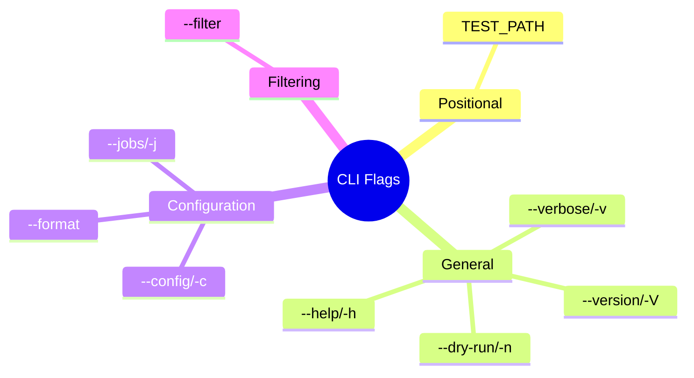
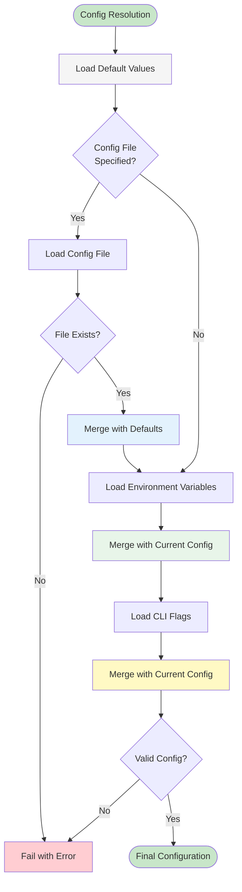
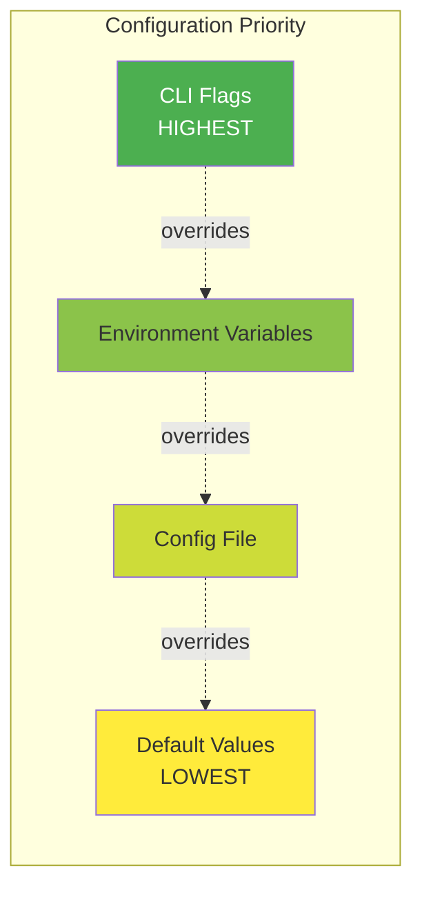
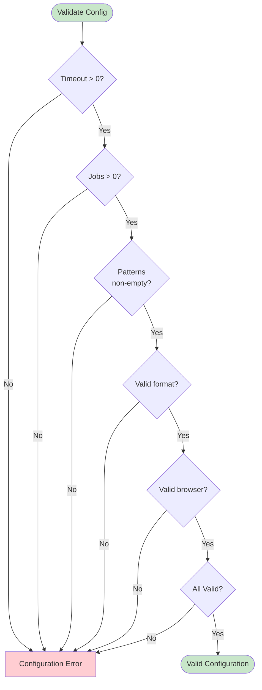
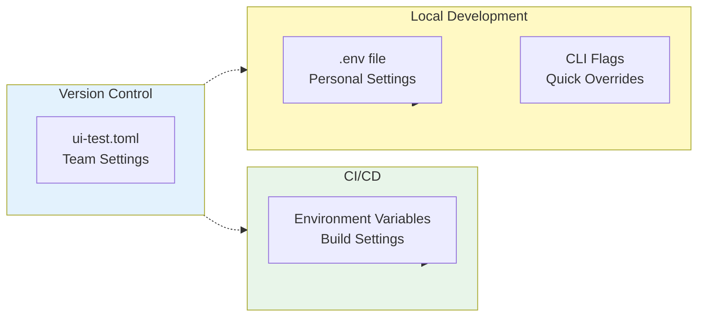
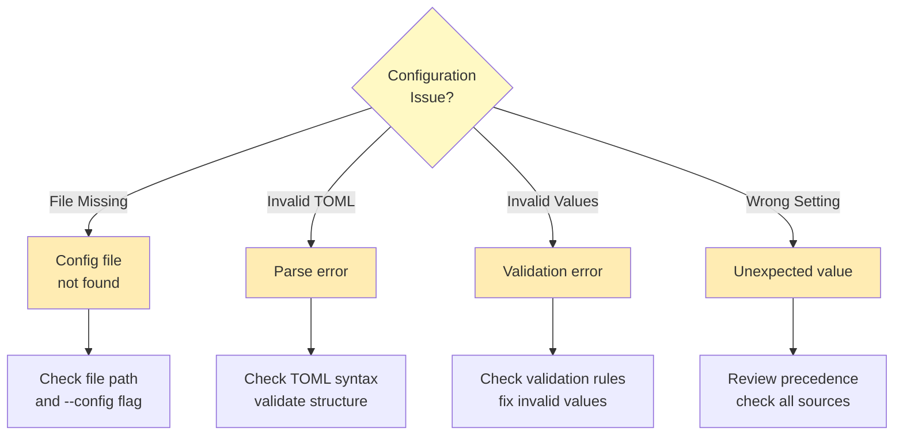

# Configuration

This page describes the configuration system in ui-test-rs, including configuration sources, precedence rules, and available options.

## Overview

ui-test-rs uses a flexible multi-layered configuration system that allows settings to come from multiple sources with clear precedence rules.

### Configuration Sources



## Configuration File

### Location and Format

The configuration file is optional and should be named `ui-test.toml` in the current working directory or specified via `--config` flag.

**Format:** TOML (Tom's Obvious, Minimal Language)

### Full Configuration Example

```toml
# ui-test.toml - UI Test Runner Configuration

# Test Discovery
[discovery]
patterns = ["*_test.rs", "test_*.rs"]
exclude = ["target/**", "node_modules/**", ".git/**"]

# Browser Configuration
[browser]
type = "chromium"  # Options: chromium, firefox, webkit
headless = true
viewport = { width = 1280, height = 720 }

# Playwright MCP Settings
[playwright]
server_url = "npx -y @playwright/mcp"
timeout = 30000  # milliseconds (30 seconds)
retries = 3

# Output Settings
[output]
format = "text"  # Options: text, json, junit
verbose = false
color = true

# Parallel Execution
[execution]
jobs = 4  # Number of parallel workers
fail_fast = false  # Stop on first failure
```

### Configuration Sections



## Environment Variables

All configuration options can be overridden via environment variables using the `UI_TEST_` prefix.

### Supported Variables

| Variable | Type | Example | Description |
|----------|------|---------|-------------|
| `UI_TEST_VERBOSE` | Boolean | `1`, `true`, `yes` | Enable verbose output |
| `UI_TEST_FORMAT` | String | `json`, `junit` | Output format |
| `UI_TEST_BROWSER` | String | `firefox`, `webkit` | Browser type |
| `UI_TEST_HEADLESS` | Boolean | `1`, `true`, `yes` | Run in headless mode |
| `UI_TEST_JOBS` | Integer | `8` | Number of parallel workers |
| `UI_TEST_TIMEOUT` | Integer | `60000` | Test timeout in milliseconds |
| `PLAYWRIGHT_MCP_URL` | String | `npx -y @playwright/mcp` | MCP server command |

### Boolean Values

Environment variables accept multiple formats for boolean values:

**True:** `1`, `true`, `True`, `TRUE`, `yes`, `Yes`, `YES`
**False:** `0`, `false`, `False`, `FALSE`, `no`, `No`, `NO`

### Example Usage

```bash
# Enable verbose output
export UI_TEST_VERBOSE=1

# Set output format to JSON
export UI_TEST_FORMAT=json

# Use 8 parallel workers
export UI_TEST_JOBS=8

# Run tests
ui-test-rs tests/
```

## CLI Flags

Command-line flags have the highest priority and override all other configuration sources.

### Available Flags



### Flag Reference

| Flag | Short | Type | Default | Description |
|------|-------|------|---------|-------------|
| `TEST_PATH` | - | Path | `.` | Path to test file or directory |
| `--verbose` | `-v` | Boolean | `false` | Enable verbose output |
| `--dry-run` | `-n` | Boolean | `false` | Preview without executing |
| `--format` | - | Enum | `text` | Output format (text/json/junit) |
| `--config` | `-c` | Path | - | Config file path |
| `--filter` | - | String | - | Filter tests by name pattern |
| `--jobs` | `-j` | Integer | `1` | Number of parallel workers |
| `--help` | `-h` | Flag | - | Show help message |
| `--version` | `-V` | Flag | - | Show version info |

## Configuration Precedence

### Resolution Algorithm



### Precedence Examples

#### Example 1: Verbose Flag

```
Default:     verbose = false
File:        (not set)
Environment: UI_TEST_VERBOSE=1
CLI:         (not set)
---
Result:      verbose = true  (from environment)
```

#### Example 2: Output Format

```
Default:     format = text
File:        format = json
Environment: (not set)
CLI:         --format junit
---
Result:      format = junit  (from CLI)
```

#### Example 3: Job Count

```
Default:     jobs = 1
File:        jobs = 4
Environment: UI_TEST_JOBS=8
CLI:         (not set)
---
Result:      jobs = 8  (from environment)
```

### Precedence Visualization



## Default Configuration

### Built-in Defaults

```rust
// Conceptual representation of default configuration
Config {
    discovery: Discovery {
        patterns: vec!["*_test.rs", "test_*.rs"],
        exclude: vec!["target/**", ".git/**"],
    },
    browser: Browser {
        type: BrowserType::Chromium,
        headless: true,
        viewport: Viewport { width: 1280, height: 720 },
    },
    playwright: Playwright {
        server_url: "npx -y @playwright/mcp",
        timeout: 30000,  // 30 seconds
        retries: 3,
    },
    output: Output {
        format: OutputFormat::Text,
        verbose: false,
        color: true,
    },
    execution: Execution {
        jobs: 1,
        fail_fast: false,
    },
}
```

## Configuration Validation

### Validation Rules



### Validation Errors

Common validation errors and their messages:

| Error | Message | Fix |
|-------|---------|-----|
| Invalid timeout | "Timeout must be greater than 0" | Set `playwright.timeout > 0` |
| Invalid jobs | "Jobs must be at least 1" | Set `execution.jobs >= 1` |
| Empty patterns | "At least one discovery pattern required" | Add to `discovery.patterns` |
| Invalid format | "Format must be text, json, or junit" | Use valid format value |
| Invalid browser | "Browser must be chromium, firefox, or webkit" | Use valid browser type |

## Configuration Best Practices

### 1. Use Config File for Project Settings

Store project-specific settings in `ui-test.toml`:

```toml
# Commit this file to version control
[discovery]
patterns = ["*_test.rs"]

[browser]
type = "chromium"
headless = true
```

### 2. Use Environment Variables for CI/CD

```bash
# In CI/CD pipeline
export UI_TEST_VERBOSE=1
export UI_TEST_FORMAT=junit
export UI_TEST_JOBS=4
```

### 3. Use CLI Flags for One-off Overrides

```bash
# Quick debugging with verbose output
ui-test-rs -v tests/specific_test.rs

# Generate JSON for custom processing
ui-test-rs --format json tests/ > results.json
```

### 4. Configuration Organization



## Configuration Examples

### Example 1: Development Setup

```toml
# ui-test.toml - Development configuration
[browser]
headless = false  # See browser for debugging
viewport = { width = 1920, height = 1080 }

[output]
verbose = true
color = true

[execution]
jobs = 1  # Sequential for easier debugging
fail_fast = true  # Stop on first failure
```

### Example 2: CI/CD Setup

```bash
# In CI/CD pipeline script
export UI_TEST_HEADLESS=1
export UI_TEST_FORMAT=junit
export UI_TEST_JOBS=8
export UI_TEST_VERBOSE=1

ui-test-rs tests/ --format junit > test-results.xml
```

### Example 3: Custom Browser

```toml
# ui-test.toml - Using Firefox
[browser]
type = "firefox"
headless = true

[playwright]
timeout = 60000  # Longer timeout for slower browser
```

## Troubleshooting

### Debug Configuration

To see the final resolved configuration, use verbose mode:

```bash
ui-test-rs -v --dry-run tests/
```

This will show:
- Loaded configuration sources
- Final merged configuration
- Validation results

### Common Issues



## Related Documentation

- [Architecture](Architecture) - System architecture
- [CLI Interface](CLI-Interface) - Command-line interface details
- [Development Guide](Development-Guide) - Building and testing

---

**Last Updated:** 2025-11-18
