# Development Guide

This guide covers building, testing, and contributing to ui-test-rs.

## Table of Contents

- [Prerequisites](#prerequisites)
- [Building](#building)
- [Testing](#testing)
- [Quality Checks](#quality-checks)
- [Development Workflow](#development-workflow)
- [Project Standards](#project-standards)
- [Common Tasks](#common-tasks)

## Prerequisites

### Required Tools


### Installation

```bash
# Install Rust (if not already installed)
curl --proto '=https' --tlsv1.2 -sSf https://sh.rustup.rs | sh

# Install Node.js (for Playwright MCP)
# macOS
brew install node

# Linux
curl -fsSL https://deb.nodesource.com/setup_20.x | sudo -E bash -
sudo apt-get install -y nodejs

# Verify installations
rustc --version
cargo --version
node --version
npm --version
```

### Custom Tools Setup

The custom tools are available in `~/.local/softwarewrighter/bin/`:

```bash
# Add to PATH (add to .bashrc or .zshrc)
export PATH="$HOME/.local/softwarewrighter/bin:$PATH"

# Verify tools are available
markdown-checker --version
sw-checklist --version
sw-install --version
```

## Building

### CRITICAL: Always Use Build Scripts

**NEVER use `cargo build` directly. ALWAYS use the build script.**

```bash
# Release build (default) - ALWAYS USE THIS
./scripts/build-all.sh

# Development build
./scripts/build-all.sh dev

# Explicit release build
./scripts/build-all.sh release
```

### Why Use Scripts?

```mermaid
flowchart TB
    Script[./scripts/build-all.sh]

    Meta[Capture Build Metadata<br/>• Host<br/>• Commit<br/>• Timestamp]
    Env[Set Environment Variables]
    Build[Run Cargo Build]
    Verify[Verify Build Success]

    Script --> Meta
    Meta --> Env
    Env --> Build
    Build --> Verify

    style Script fill:#c8e6c9
    style Meta fill:#fff9c4
    style Verify fill:#e8f5e9
```



### Build Process


### Installation

```bash
# Build and install in one step
./scripts/build-all.sh && sw-install -p .

# Verify installation
ui-test-rs --version
```

## Testing

### Test Types


### Running Tests

```bash
# Run all tests
cargo test

# Run specific test
cargo test test_name

# Run with output
cargo test -- --nocapture

# Run integration tests only
cargo test --test cli_tests

# Run with verbose output
cargo test -- --test-threads=1 --nocapture
```

### Test Organization

```mermaid
graph TB
    subgraph UnitTests["Unit Tests (in source files)"]
        Config[config.rs<br/>#[cfg(test)] mod tests]
        Loader[loader.rs<br/>#[cfg(test)] mod tests]
        Reporter[reporter.rs<br/>#[cfg(test)] mod tests]
    end

    subgraph IntegrationTests["Integration Tests (tests/ directory)"]
        CLI[cli_tests.rs]
        E2E[e2e_tests.rs]
    end

    style UnitTests fill:#e8f5e9
    style IntegrationTests fill:#fff9c4
```

## Quality Checks

### Pre-Commit Checks

**Run these in order before EVERY commit:**


### Individual Checks

```bash
# 0. Build with metadata (ALWAYS use the script)
./scripts/build-all.sh

# 1. Tests
cargo test

# 2. Linting (zero warnings allowed)
cargo clippy --all-targets --all-features -- -D warnings

# 3. Formatting
cargo fmt --all

# 4. Markdown validation
markdown-checker -f "**/*.md"

# 5. Project standards
sw-checklist .

# 6. Update status
vim docs/status.md  # Update current progress
```

### Linting Rules

```mermaid
graph TB
    Clippy[cargo clippy]

    subgraph Rules["Clippy Rules"]
        Warn[Warnings → Errors<br/>-D warnings]
        Unused[No unused imports]
        Needless[No needless borrows]
        Format[Inline format args]
    end

    Clippy --> Rules

    Pass{All Rules<br/>Pass?}
    Success([Success])
    Fix([Fix Issues])

    Rules --> Pass
    Pass -->|Yes| Success
    Pass -->|No| Fix

    style Clippy fill:#fff9c4
    style Success fill:#c8e6c9
    style Fix fill:#ffcdd2
```



## Development Workflow

### TDD Cycle

ui-test-rs follows strict Test-Driven Development:

```mermaid
flowchart LR
    Red[🔴 RED<br/>Write Failing Test]
    Green[🟢 GREEN<br/>Make Test Pass]
    Refactor[🔵 REFACTOR<br/>Improve Code]

    Red --> Green
    Green --> Refactor
    Refactor --> Red

    style Red fill:#ffcdd2
    style Green fill:#c8e6c9
    style Refactor fill:#e1f5ff
```



### Development Process

```mermaid
sequenceDiagram
    participant Dev as Developer
    participant Test
    participant Code
    participant Quality

    Dev->>Test: Write failing test (RED)
    activate Test
    Test-->>Dev: Test fails ✗
    deactivate Test

    Dev->>Code: Write minimal code (GREEN)
    activate Code
    Code-->>Test: Run test
    activate Test
    Test-->>Dev: Test passes ✓
    deactivate Test
    deactivate Code

    Dev->>Code: Refactor (REFACTOR)
    activate Code
    Code-->>Test: Run tests
    activate Test
    Test-->>Dev: All tests pass ✓
    deactivate Test
    deactivate Code

    Dev->>Quality: Run quality checks
    activate Quality
    Quality-->>Dev: All checks pass ✓
    deactivate Quality

    Dev->>Dev: Commit changes
```



## Project Standards

### Code Constraints

```mermaid
graph TB
    subgraph Constraints["Code Constraints"]
        FileSize[File Size<br/>Max: 500 lines<br/>Prefer: 200-300]
        FuncSize[Function Size<br/>Max: 50 lines<br/>Prefer: 10-30]
        TODO[TODO Comments<br/>Max: 3 per file]
        FIXME[FIXME Comments<br/>Never commit]
    end

    subgraph RustStandards["Rust Standards"]
        Edition[Edition: 2021<br/>Idioms: 2024]
        Inline[Inline format args<br/>format!"{name}"]
        DocComments[Module docs: //!<br/>Item docs: ///]
    end

    style Constraints fill:#ffecb3
    style RustStandards fill:#e8f5e9
```

### File Organization


### Documentation Standards

```rust
//! Module-level documentation
//! Use //! at the top of files

/// Item-level documentation
/// Use /// before items (functions, structs, etc.)
pub fn example() {
    // Implementation
}
```

## Common Tasks

### Adding a New Feature

```mermaid
flowchart TB
    Start([New Feature Request])
    Plan[Plan Implementation<br/>Update docs/plan.md]
    Test[Write Tests<br/>RED phase]
    Implement[Implement Feature<br/>GREEN phase]
    Refactor[Refactor Code<br/>REFACTOR phase]
    Quality[Run Quality Checks]
    UpdateDocs[Update Documentation<br/>• README.md<br/>• docs/status.md]
    Commit[Commit & Push]
    Done([Feature Complete])

    Start --> Plan
    Plan --> Test
    Test --> Implement
    Implement --> Refactor
    Refactor --> Quality
    Quality --> UpdateDocs
    UpdateDocs --> Commit
    Commit --> Done

    style Start fill:#c8e6c9
    style Done fill:#c8e6c9
```



### Fixing a Bug


### Refactoring Code


## Commit Process

### Commit Message Format

```
type: brief description

[AI] Generated with [Claude Code](https://claude.com/claude-code)

Co-Authored-By: Claude <noreply@anthropic.com>
```

### Commit Types

- `feat:` - New feature
- `fix:` - Bug fix
- `docs:` - Documentation changes
- `refactor:` - Code refactoring
- `test:` - Adding or updating tests
- `chore:` - Maintenance tasks

### Full Commit Workflow

```bash
# After all quality checks pass

# Stage all changes
git add -A

# Commit with message
git commit -m "feat: Add browser action timeout handling

[AI] Generated with [Claude Code](https://claude.com/claude-code)

Co-Authored-By: Claude <noreply@anthropic.com>"

# Push to remote
git push
```

## Troubleshooting

### Common Issues


### Debug Tips

```bash
# Verbose build
RUST_BACKTRACE=1 ./scripts/build-all.sh

# Run single test with output
cargo test test_name -- --nocapture

# Check what clippy would fix
cargo clippy --fix

# Preview formatting changes
cargo fmt --all -- --check
```

## Related Documentation

- [Architecture](Architecture) - System architecture
- [Testing Strategy](Testing-Strategy) - Testing approach
- [CLI Interface](CLI-Interface) - Command-line interface
- [Configuration](Configuration) - Configuration system

---

**Last Updated:** 2025-11-18
