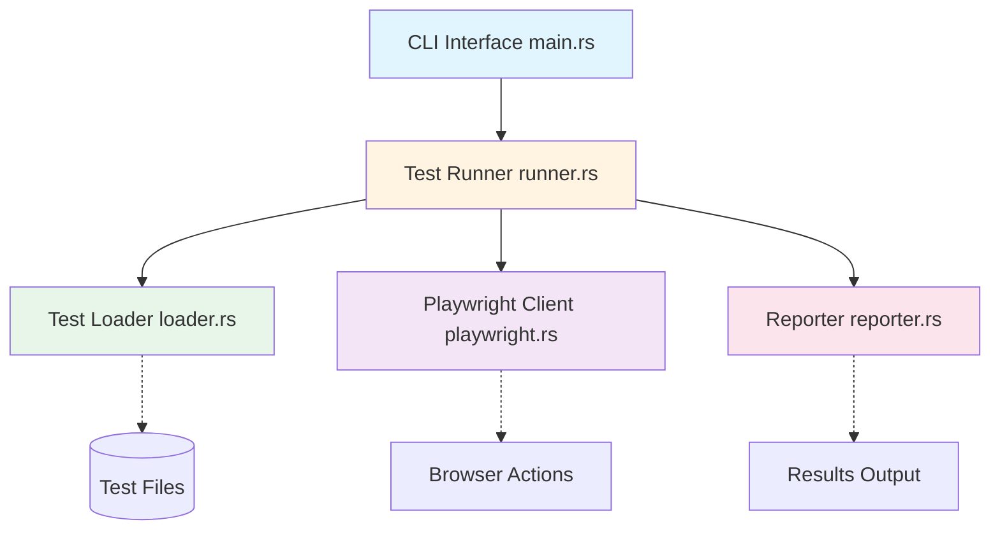

# ui-test-rs Wiki

Welcome to the **ui-test-rs** documentation wiki! This is a Rust CLI tool for UI testing that integrates with Playwright MCP (Model Context Protocol) for browser automation.

## Overview

`ui-test-rs` provides a simple, efficient interface for running web UI tests from the command line. It uses accessibility trees instead of screenshots for deterministic element selection, making tests more reliable and faster to execute.

**Key Features:**
- Simple CLI interface with AI-specific help
- Playwright MCP integration for browser automation
- Multiple output formats (text, JSON, JUnit XML)
- Parallel test execution
- Convention-based test discovery
- Flexible configuration system

**Current Status:** Phase 1 - Foundation (documentation complete, implementation starting)

## Quick Start

```bash
# Install
cargo install ui-test-rs

# Run tests
ui-test-rs tests/

# Run with verbose output
ui-test-rs -v tests/

# Output as JSON
ui-test-rs --format json tests/
```

## Documentation

### Architecture & Design
- **[Architecture](Architecture)** - System architecture and component overview with diagrams
- **[Sequences](Sequences)** - Flow diagrams and sequence diagrams for key operations
- **[Configuration](Configuration)** - Configuration system and precedence rules

### Components
- **[CLI Interface](CLI-Interface)** - Command-line interface and argument parsing
- **[Test Runner](Test-Runner)** - Test execution orchestration and lifecycle
- **[Test Loader](Test-Loader)** - Test discovery and file parsing
- **[Playwright Client](Playwright-Client)** - Browser automation and MCP integration
- **[Reporter](Reporter)** - Output formatting and result reporting

### Development
- **[Development Guide](Development-Guide)** - Building, testing, and contributing
- **[Testing Strategy](Testing-Strategy)** - Unit, integration, and end-to-end testing

## Architecture at a Glance



## Key Concepts

### Test Discovery
Tests are discovered using convention-based patterns:
- `*_test.rs` (e.g., `login_test.rs`)
- `test_*.rs` (e.g., `test_login.rs`)
- Files in `tests/` directory

### Configuration Precedence
Configuration is merged from multiple sources with this precedence (highest to lowest):
1. CLI flags (e.g., `--verbose`)
2. Environment variables (e.g., `UI_TEST_VERBOSE=1`)
3. Config file (`ui-test.toml`)
4. Default values

### Exit Codes
- `0` - All tests passed
- `1` - Some tests failed
- `2` - Error (config, discovery, MCP connection, etc.)

## Resources

- **Repository:** https://github.com/softwarewrighter/ui-test-rs
- **Playwright MCP:** https://github.com/microsoft/playwright-mcp
- **License:** MIT
- **Author:** Michael A Wright

## Getting Help

- Check the [Development Guide](Development-Guide) for building and testing
- See [Architecture](Architecture) for system design details
- Review [Sequences](Sequences) for understanding data flows
- Component-specific details are in individual component pages

---

**Version:** 0.1.0
**Last Updated:** 2025-11-18
