# Playwright Client

The Playwright Client component (`playwright.rs`) manages the connection to the Playwright MCP server and provides browser automation capabilities using accessibility trees for element selection.

## Overview

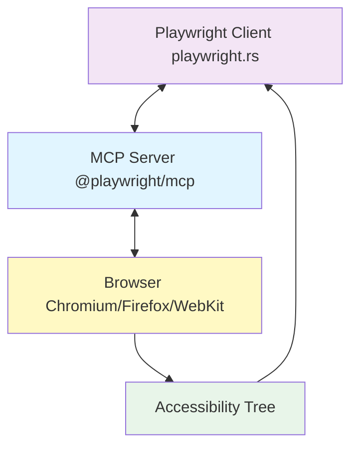
```mermaid
flowchart TB
    Client[Playwright Client playwright.rs]
    MCP[MCP Server @playwright/mcp]
    Browser[Browser Chromium/Firefox/WebKit]
    ATree[Accessibility Tree]

    Client <--> MCP
    MCP <--> Browser
    Browser --> ATree
    ATree --> Client

    style Client fill:#f3e5f5
    style MCP fill:#e1f5ff
    style Browser fill:#fff9c4
    style ATree fill:#e8f5e9
```

## Responsibilities

- Establish and maintain MCP server connection
- Send browser automation commands
- Parse accessibility tree for element selection
- Handle browser lifecycle (launch, navigate, close)
- Execute browser actions (click, type, navigate)
- Capture screenshots and snapshots
- Manage timeouts and retries

## Structure

### PlaywrightClient Struct

```rust
struct PlaywrightClient {
    process: Child,
    stdin: ChildStdin,
    stdout: BufReader<ChildStdout>,
    config: PlaywrightConfig,
}

impl PlaywrightClient {
    async fn connect(config: &PlaywrightConfig) -> Result<Self>;
    async fn disconnect(&mut self) -> Result<()>;
    async fn send_command(&mut self, cmd: Command) -> Result<Response>;
    async fn snapshot(&self) -> Result<AccessibilitySnapshot>;
}
```

### Component Diagram

```mermaid
classDiagram
    class PlaywrightClient {
        -Child process
        -ChildStdin stdin
        -BufReader~ChildStdout~ stdout
        -PlaywrightConfig config
        +connect(config) Result~Self~
        +disconnect() Result
        +send_command(cmd) Result~Response~
        +snapshot() Result~AccessibilitySnapshot~
        +navigate(url) Result
        +click(selector) Result
        +fill(selector, text) Result
    }

    class Command {
        <<enumeration>>
        Navigate(String)
        Click{element, ref_id}
        Type{element, ref_id, text}
        Snapshot
        Screenshot{path}
    }

    class AccessibilitySnapshot {
        +Vec~Element~ elements
        +find_element(selector) Result~Element~
    }

    class Element {
        +String ref_id
        +String role
        +String name
        +String description
    }

    PlaywrightClient --> Command
    PlaywrightClient --> AccessibilitySnapshot
    AccessibilitySnapshot "1" --> "*" Element
```

## MCP Connection

### Connection Flow

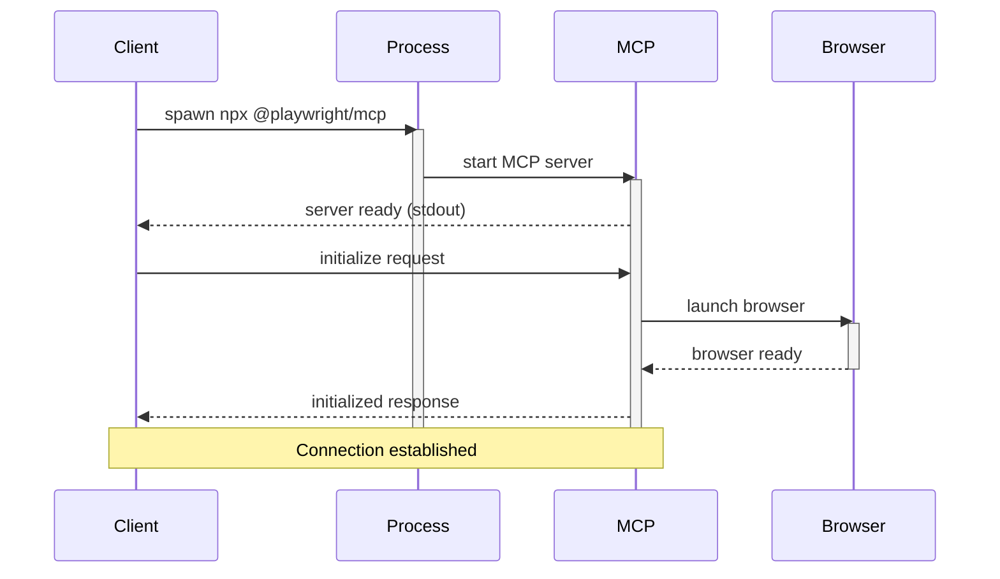
```mermaid
sequenceDiagram
    participant Client
    participant Process
    participant MCP
    participant Browser

    Client->>Process: spawn npx @playwright/mcp
    activate Process

    Process->>MCP: start MCP server
    activate MCP

    MCP-->>Client: server ready (stdout)

    Client->>MCP: initialize request
    MCP->>Browser: launch browser
    activate Browser
    Browser-->>MCP: browser ready
    deactivate Browser

    MCP-->>Client: initialized response

    Note over Client,MCP: Connection established

    deactivate MCP
    deactivate Process
```

### Connection State Machine

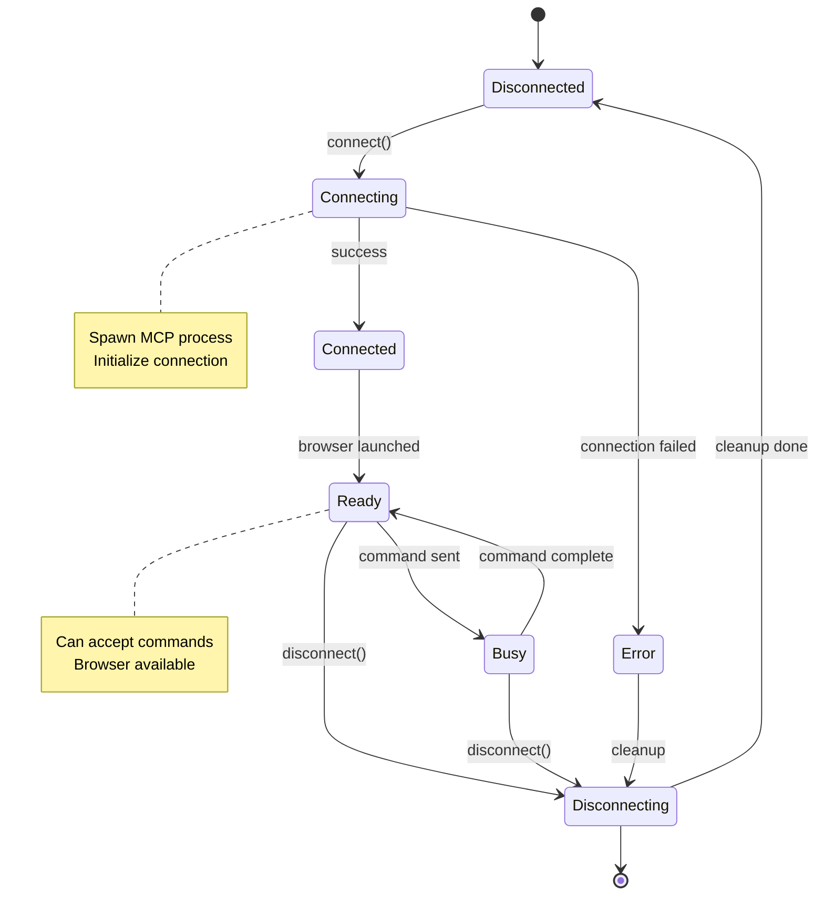
```mermaid
stateDiagram-v2
    [*] --> Disconnected
    Disconnected --> Connecting: connect()
    Connecting --> Connected: success
    Connecting --> Error: connection failed

    Connected --> Ready: browser launched
    Ready --> Busy: command sent
    Busy --> Ready: command complete

    Ready --> Disconnecting: disconnect()
    Busy --> Disconnecting: disconnect()
    Disconnecting --> Disconnected: cleanup done

    Error --> Disconnecting: cleanup
    Disconnecting --> [*]

    note right of Connecting
        Spawn MCP process
        Initialize connection
    end note

    note right of Ready
        Can accept commands
        Browser available
    end note
```

## Browser Actions

### Navigate Action

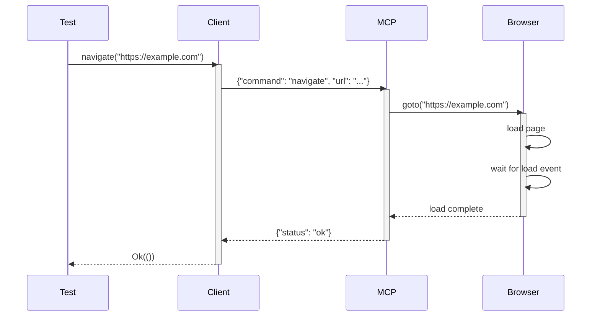
```mermaid
sequenceDiagram
    participant Test
    participant Client
    participant MCP
    participant Browser

    Test->>Client: navigate("https://example.com")
    activate Client

    Client->>MCP: {"command": "navigate", "url": "..."}
    activate MCP

    MCP->>Browser: goto("https://example.com")
    activate Browser
    Browser->>Browser: load page
    Browser->>Browser: wait for load event
    Browser-->>MCP: load complete
    deactivate Browser

    MCP-->>Client: {"status": "ok"}
    deactivate MCP

    Client-->>Test: Ok(())
    deactivate Client
```

### Click Action with Element Selection

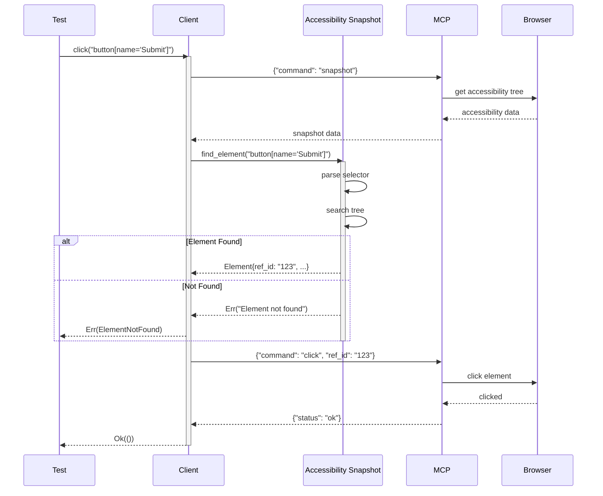
```mermaid
sequenceDiagram
    participant Test
    participant Client
    participant Snapshot as Accessibility Snapshot
    participant MCP
    participant Browser

    Test->>Client: click("button[name='Submit']")
    activate Client

    Client->>MCP: {"command": "snapshot"}
    MCP->>Browser: get accessibility tree
    Browser-->>MCP: accessibility data
    MCP-->>Client: snapshot data

    Client->>Snapshot: find_element("button[name='Submit']")
    activate Snapshot
    Snapshot->>Snapshot: parse selector
    Snapshot->>Snapshot: search tree

    alt Element Found
        Snapshot-->>Client: Element{ref_id: "123", ...}
    else Not Found
        Snapshot-->>Client: Err("Element not found")
        Client-->>Test: Err(ElementNotFound)
    end
    deactivate Snapshot

    Client->>MCP: {"command": "click", "ref_id": "123"}
    MCP->>Browser: click element
    Browser-->>MCP: clicked
    MCP-->>Client: {"status": "ok"}

    Client-->>Test: Ok(())
    deactivate Client
```

### Fill Text Action

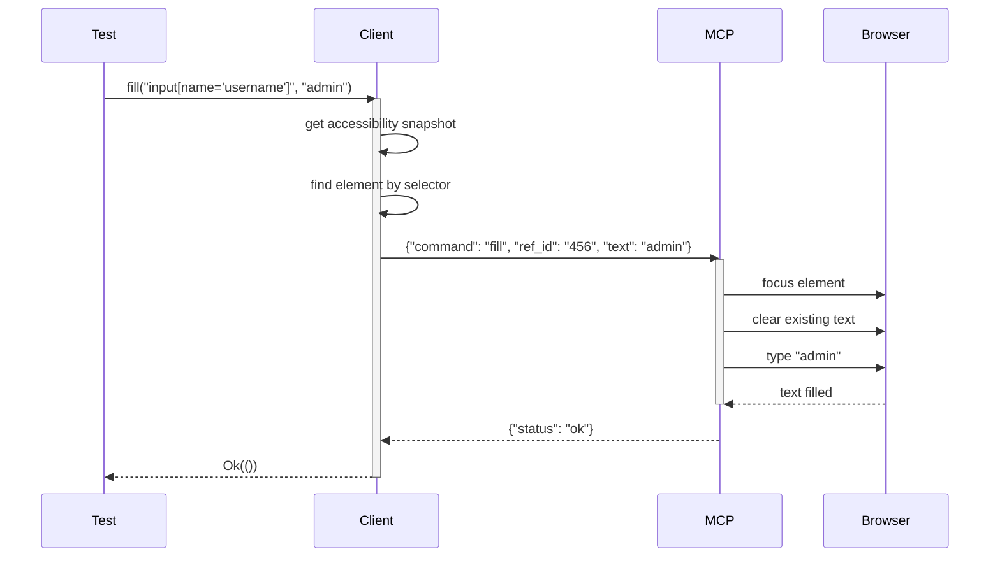
```mermaid
sequenceDiagram
    participant Test
    participant Client
    participant MCP
    participant Browser

    Test->>Client: fill("input[name='username']", "admin")
    activate Client

    Client->>Client: get accessibility snapshot
    Client->>Client: find element by selector

    Client->>MCP: {"command": "fill", "ref_id": "456", "text": "admin"}
    activate MCP

    MCP->>Browser: focus element
    MCP->>Browser: clear existing text
    MCP->>Browser: type "admin"

    Browser-->>MCP: text filled
    deactivate MCP

    MCP-->>Client: {"status": "ok"}
    Client-->>Test: Ok(())
    deactivate Client
```

## Element Selection

### Accessibility Tree

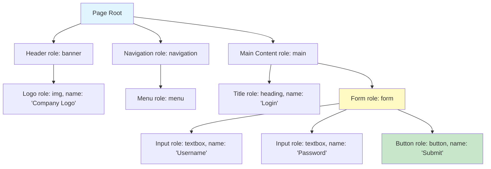
```mermaid
graph TB
    Root[Page Root]

    Header[Header role: banner]
    Nav[Navigation role: navigation]
    Main[Main Content role: main]

    Logo[Logo role: img, name: 'Company Logo']
    Menu[Menu role: menu]

    Title[Title role: heading, name: 'Login']
    Form[Form role: form]

    Username[Input role: textbox, name: 'Username']
    Password[Input role: textbox, name: 'Password']
    Submit[Button role: button, name: 'Submit']

    Root --> Header
    Root --> Nav
    Root --> Main

    Header --> Logo
    Nav --> Menu

    Main --> Title
    Main --> Form

    Form --> Username
    Form --> Password
    Form --> Submit

    style Root fill:#e1f5ff
    style Form fill:#fff9c4
    style Submit fill:#c8e6c9
```

### Selector Types

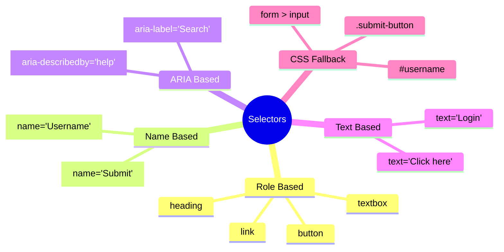
```mermaid
mindmap
  root((Selectors))
    Role Based
      button
      link
      textbox
      heading
    Name Based
      [name='Submit']
      [name='Username']
    ARIA Based
      [aria-label='Search']
      [aria-describedby='help']
    Text Based
      text='Login'
      text='Click here'
    CSS Fallback
      #username
      .submit-button
      form > input
```

### Element Selection Algorithm

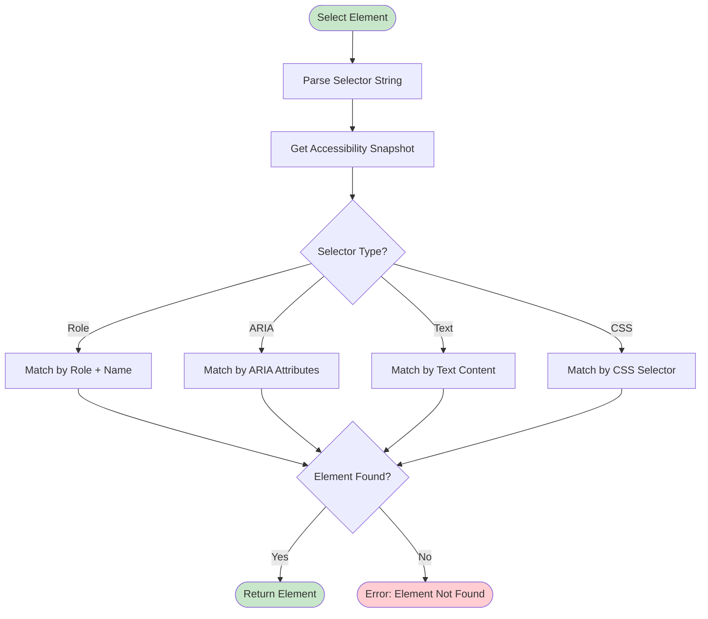
```mermaid
flowchart TB
    Start([Select Element])
    ParseSelector[Parse Selector String]
    GetSnapshot[Get Accessibility Snapshot]

    CheckType{Selector Type?}

    RoleMatch[Match by Role + Name]
    AriaMatch[Match by ARIA Attributes]
    TextMatch[Match by Text Content]
    CSSMatch[Match by CSS Selector]

    Found{Element Found?}
    Success([Return Element])
    NotFound([Error: Element Not Found])

    Start --> ParseSelector
    ParseSelector --> GetSnapshot
    GetSnapshot --> CheckType

    CheckType -->|Role| RoleMatch
    CheckType -->|ARIA| AriaMatch
    CheckType -->|Text| TextMatch
    CheckType -->|CSS| CSSMatch

    RoleMatch --> Found
    AriaMatch --> Found
    TextMatch --> Found
    CSSMatch --> Found

    Found -->|Yes| Success
    Found -->|No| NotFound

    style Start fill:#c8e6c9
    style Success fill:#c8e6c9
    style NotFound fill:#ffcdd2
```

### Selector Examples

```rust
// Role-based selector
client.click("button[name='Submit']").await?;

// ARIA-based selector
client.click("[aria-label='Search']").await?;

// Text-based selector
client.click("text='Login'").await?;

// CSS selector (fallback)
client.click("#submit-button").await?;

// Combined selector
client.click("button[name='Submit'][aria-label='Submit form']").await?;
```

## Command Protocol

### Command Types

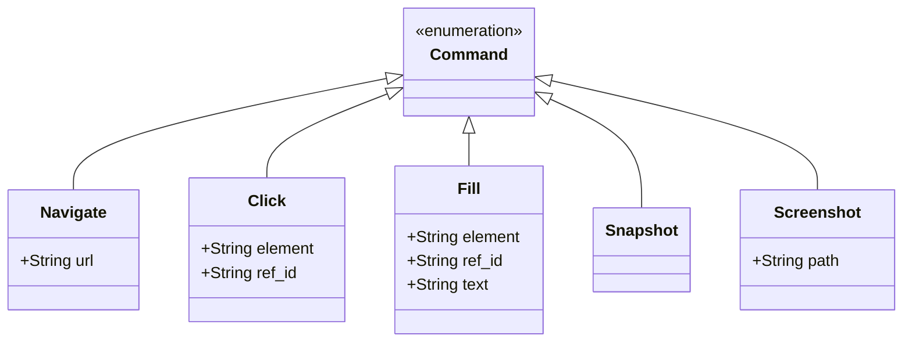
```mermaid
classDiagram
    class Command {
        <<enumeration>>
    }

    class Navigate {
        +String url
    }

    class Click {
        +String element
        +String ref_id
    }

    class Fill {
        +String element
        +String ref_id
        +String text
    }

    class Snapshot {
    }

    class Screenshot {
        +String path
    }

    Command <|-- Navigate
    Command <|-- Click
    Command <|-- Fill
    Command <|-- Snapshot
    Command <|-- Screenshot
```

### Request/Response Flow

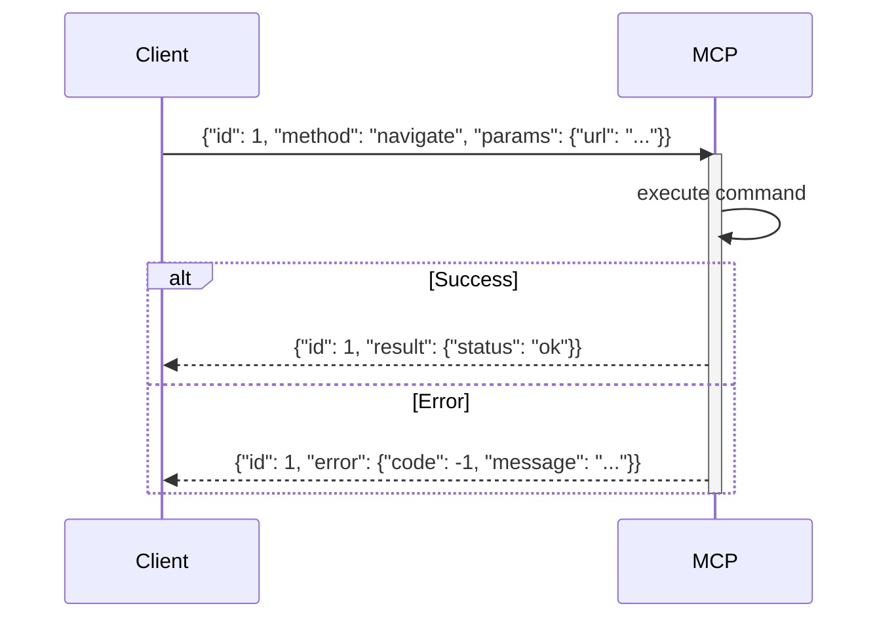
```mermaid
sequenceDiagram
    participant Client
    participant MCP

    Client->>MCP: {"id": 1, "method": "navigate", "params": {"url": "..."}}
    activate MCP

    MCP->>MCP: execute command

    alt Success
        MCP-->>Client: {"id": 1, "result": {"status": "ok"}}
    else Error
        MCP-->>Client: {"id": 1, "error": {"code": -1, "message": "..."}}
    end

    deactivate MCP
```

## Error Handling

### Error Types

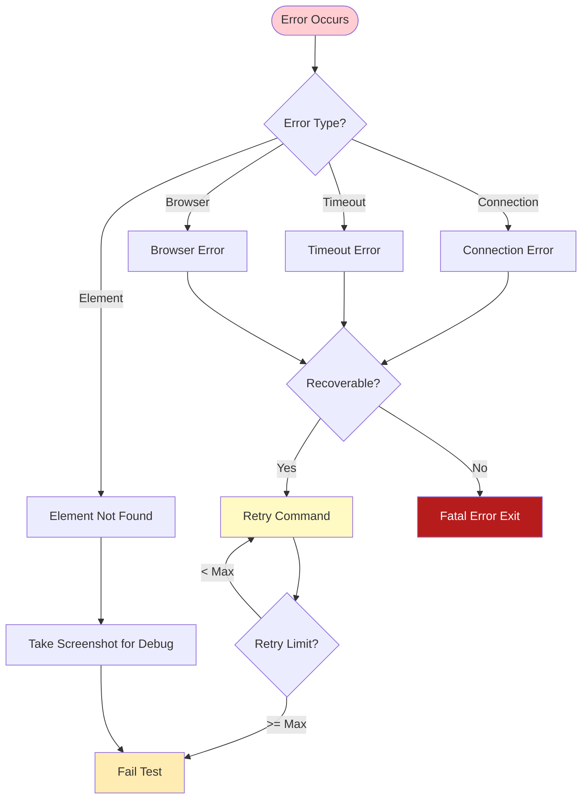
```mermaid
flowchart TB
    Error([Error Occurs])
    Type{Error Type?}

    ConnectionError[Connection Error]
    TimeoutError[Timeout Error]
    ElementNotFound[Element Not Found]
    BrowserError[Browser Error]

    Recover{Recoverable?}

    Retry[Retry Command]
    RetryCount{Retry Limit?}
    TakeScreenshot[Take Screenshot for Debug]
    FailTest[Fail Test]
    FatalError[Fatal Error Exit]

    Error --> Type

    Type -->|Connection| ConnectionError
    Type -->|Timeout| TimeoutError
    Type -->|Element| ElementNotFound
    Type -->|Browser| BrowserError

    ConnectionError --> Recover
    TimeoutError --> Recover
    ElementNotFound --> TakeScreenshot
    BrowserError --> Recover

    Recover -->|Yes| Retry
    Recover -->|No| FatalError

    Retry --> RetryCount
    RetryCount -->|< Max| Retry
    RetryCount -->|>= Max| FailTest

    TakeScreenshot --> FailTest

    style Error fill:#ffcdd2
    style FatalError fill:#b71c1c,color:#fff
    style FailTest fill:#ffecb3
    style Retry fill:#fff9c4
```

### Retry Strategy

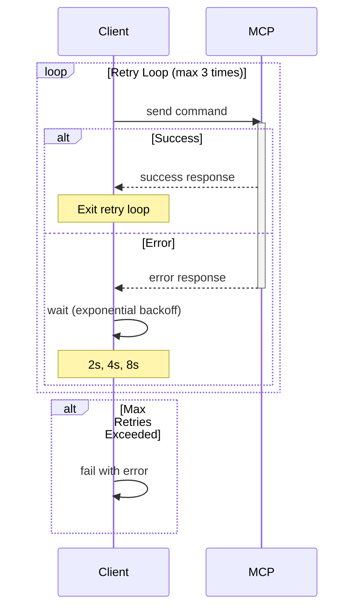
```mermaid
sequenceDiagram
    participant Client
    participant MCP

    loop Retry Loop (max 3 times)
        Client->>MCP: send command
        activate MCP

        alt Success
            MCP-->>Client: success response
            Note over Client: Exit retry loop
        else Error
            MCP-->>Client: error response
            deactivate MCP
            Client->>Client: wait (exponential backoff)
            Note over Client: 2s, 4s, 8s
        end
    end

    alt Max Retries Exceeded
        Client->>Client: fail with error
    end
```

## Browser Lifecycle

### Lifecycle Management

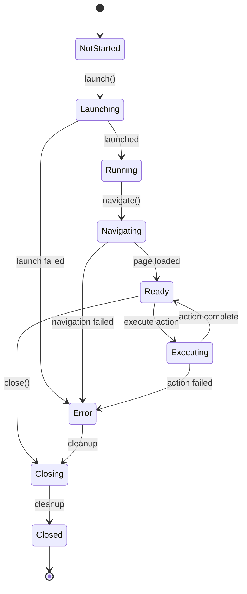
```mermaid
stateDiagram-v2
    [*] --> NotStarted
    NotStarted --> Launching: launch()
    Launching --> Running: launched
    Running --> Navigating: navigate()
    Navigating --> Ready: page loaded
    Ready --> Executing: execute action
    Executing --> Ready: action complete
    Ready --> Closing: close()
    Closing --> Closed: cleanup
    Closed --> [*]

    Launching --> Error: launch failed
    Navigating --> Error: navigation failed
    Executing --> Error: action failed
    Error --> Closing: cleanup
```

### Per-Test Browser Lifecycle

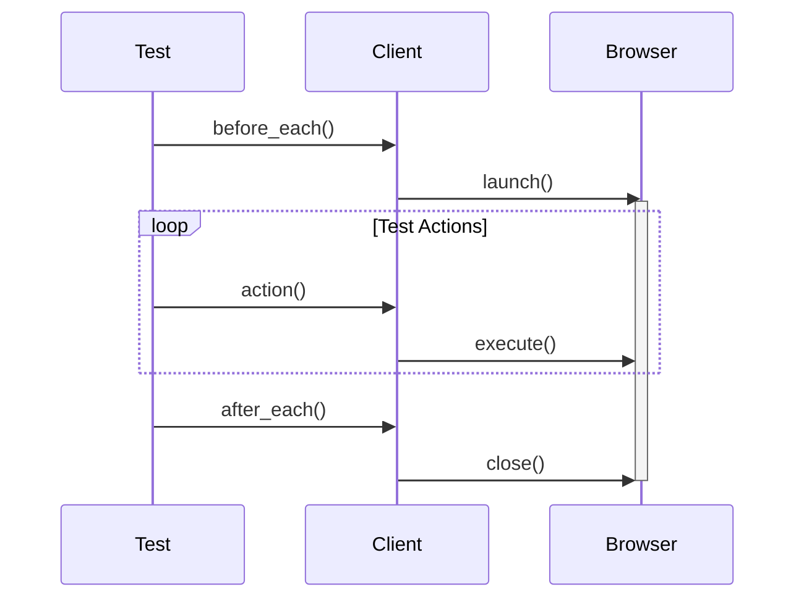
```mermaid
sequenceDiagram
    participant Test
    participant Client
    participant Browser

    Test->>Client: before_each()
    Client->>Browser: launch()
    activate Browser

    loop Test Actions
        Test->>Client: action()
        Client->>Browser: execute()
    end

    Test->>Client: after_each()
    Client->>Browser: close()
    deactivate Browser
```

## Configuration

### Playwright Configuration

```rust
struct PlaywrightConfig {
    server_url: String,       // e.g., "npx -y @playwright/mcp"
    timeout: Duration,        // Command timeout (default: 30s)
    retries: usize,          // Retry count (default: 3)
    browser: BrowserConfig,
}

struct BrowserConfig {
    browser_type: BrowserType,  // Chromium, Firefox, WebKit
    headless: bool,
    viewport: Viewport,
}

struct Viewport {
    width: u32,
    height: u32,
}
```

## Performance Optimization

### Browser Instance Pooling

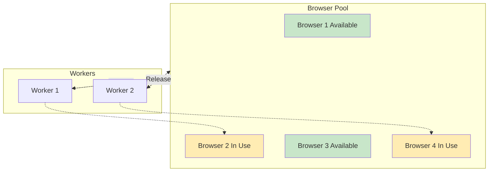
```mermaid
graph TB
    subgraph Pool["Browser Pool"]
        B1[Browser 1 Available]
        B2[Browser 2 In Use]
        B3[Browser 3 Available]
        B4[Browser 4 In Use]
    end

    subgraph Workers["Workers"]
        W1[Worker 1]
        W2[Worker 2]
    end

    W1 -.-> B2
    W2 -.-> B4

    Pool -.->|Acquire| W1
    Pool -.->|Acquire| W2
    W1 -.->|Release| Pool
    W2 -.->|Release| Pool

    style B1 fill:#c8e6c9
    style B2 fill:#ffecb3
    style B3 fill:#c8e6c9
    style B4 fill:#ffecb3
```

## Debugging Support

### Screenshot Capture

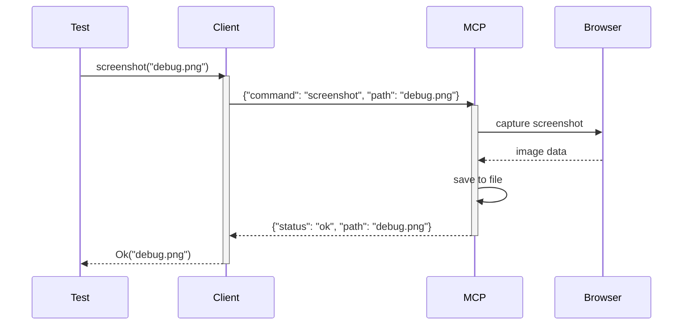
```mermaid
sequenceDiagram
    participant Test
    participant Client
    participant MCP
    participant Browser

    Test->>Client: screenshot("debug.png")
    activate Client

    Client->>MCP: {"command": "screenshot", "path": "debug.png"}
    activate MCP

    MCP->>Browser: capture screenshot
    Browser-->>MCP: image data
    MCP->>MCP: save to file

    MCP-->>Client: {"status": "ok", "path": "debug.png"}
    deactivate MCP

    Client-->>Test: Ok("debug.png")
    deactivate Client
```

## Security Considerations

### Sandboxing

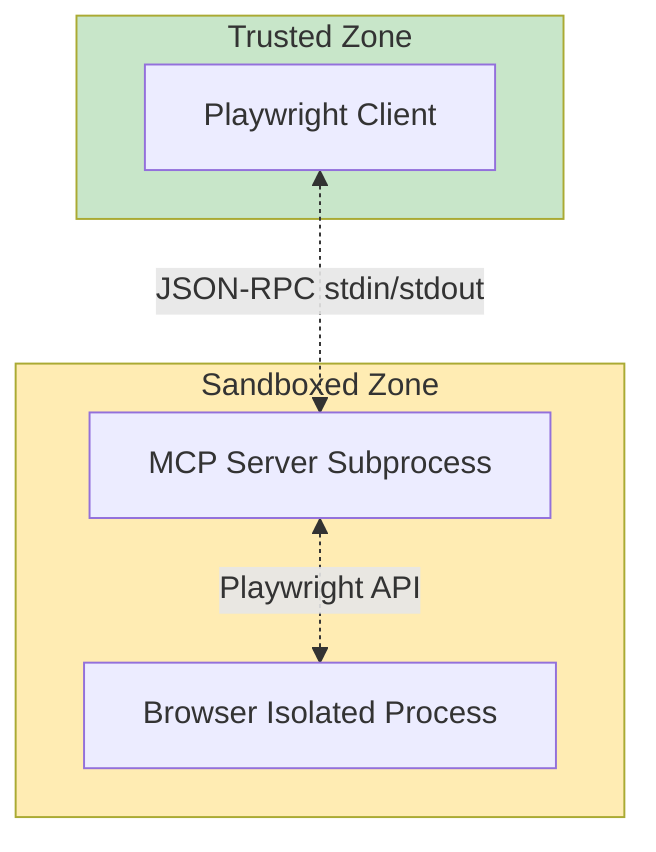
```mermaid
flowchart TB
    subgraph Trusted["Trusted Zone"]
        Client2[Playwright Client]
    end

    subgraph Sandboxed["Sandboxed Zone"]
        MCP2[MCP Server Subprocess]
        Browser2[Browser Isolated Process]
    end

    Client2 <-.->|JSON-RPC stdin/stdout| MCP2
    MCP2 <-.->|Playwright API| Browser2

    style Trusted fill:#c8e6c9
    style Sandboxed fill:#ffecb3
```

## Usage Examples

### Basic Connection

```rust
let config = PlaywrightConfig {
    server_url: "npx -y @playwright/mcp".to_string(),
    timeout: Duration::from_secs(30),
    retries: 3,
    browser: BrowserConfig::default(),
};

let client = PlaywrightClient::connect(&config).await?;
```

### Browser Actions

```rust
// Navigate to page
client.navigate("https://example.com").await?;

// Fill form
client.fill("input[name='username']", "admin").await?;
client.fill("input[name='password']", "secret").await?;

// Click button
client.click("button[name='Submit']").await?;

// Take screenshot
client.screenshot("result.png").await?;
```

## Related Documentation

- [Test Runner](Test-Runner) - Test execution
- [Architecture](Architecture) - System architecture
- [Sequences](Sequences) - Data flows
- [Configuration](Configuration) - Configuration system

---

**Last Updated:** 2025-11-18
