# Reporter

The Reporter component (`reporter.rs`) is responsible for formatting and outputting test results in various formats including text, JSON, and JUnit XML.

## Overview

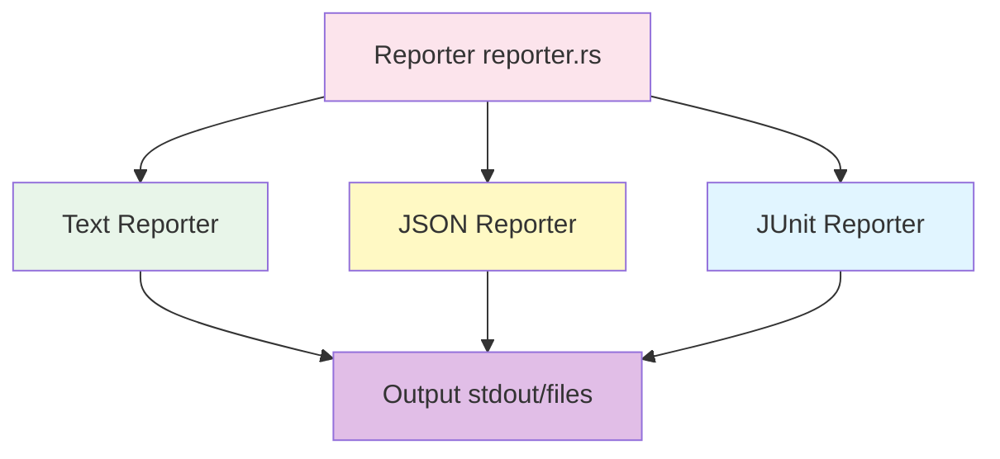

## Responsibilities

- Format test results for different output types
- Generate test statistics
- Output to console or files
- Support colorized output
- Calculate test metrics (pass rate, duration, etc.)
- Provide actionable error messages

## Structure

### Reporter Trait

```rust
trait Reporter {
    fn report_start(&mut self, suite: &TestSuite);
    fn report_test(&mut self, result: &TestResult);
    fn report_end(&mut self, stats: &TestStats);
}

struct TextReporter {
    verbose: bool,
    color: bool,
}

struct JsonReporter {
    output_path: Option<PathBuf>,
}

struct JunitReporter {
    output_path: PathBuf,
}
```

### Component Diagram

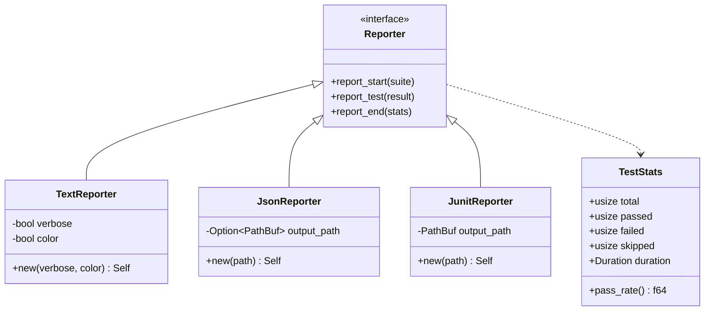

## Reporting Flow

### Reporting Sequence

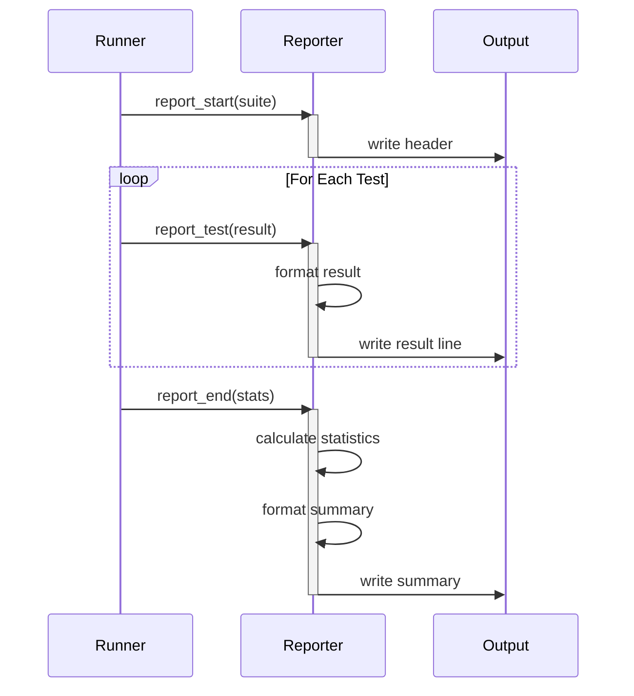

### Reporting State Machine

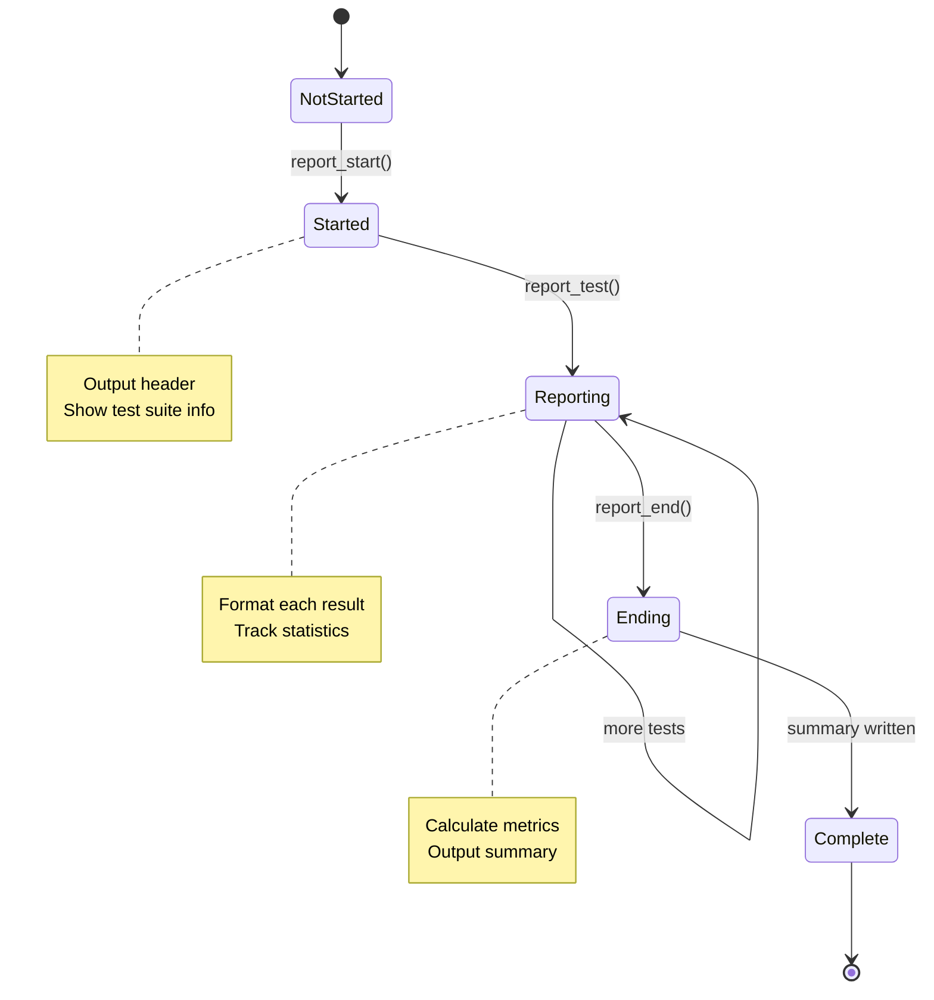

## Text Reporter

### Text Output Format

```
Running 5 tests from tests/

test tests/login_test.rs::test_admin_login ... ok (1.2s)
test tests/login_test.rs::test_user_login ... ok (0.8s)
test tests/checkout_test.rs::test_add_to_cart ... FAILED (2.1s)
test tests/checkout_test.rs::test_remove_item ... ok (1.0s)
test tests/search_test.rs::test_search ... ok (0.9s)

Failures:

---- tests/checkout_test.rs::test_add_to_cart ----
Error: Element not found: button[name="Add to Cart"]
  at tests/checkout_test.rs:15

  Suggestion: Check if the button exists in the page.
  Try: Take a screenshot to debug: ctx.screenshot("debug.png")

Summary:
  5 tests, 4 passed, 1 failed, 0 skipped
  Duration: 6.0s
  Pass rate: 80.0%

Exit code: 1
```

### Text Formatting Flow

```mermaid
flowchart TB
    Start([Format Text])
    Header[Write Header 'Running N tests from...']

    MoreTests{More Tests?}
    GetResult[Get Test Result]
    CheckStatus{Status?}

    FormatPassed[Format as: ... ok (Xs)]
    FormatFailed[Format as: ... FAILED (Xs)]
    FormatSkipped[Format as: ... skipped]
    FormatError[Format as: ... ERROR (Xs)]

    WriteResult[Write Result Line]

    AllDone{All Tests Reported?}

    FormatFailures[Format Failure Details]
    FormatSummary[Format Summary Stats]
    WriteSummary[Write Summary]

    Done([Output Complete])

    Start --> Header
    Header --> MoreTests

    MoreTests -->|Yes| GetResult
    GetResult --> CheckStatus

    CheckStatus -->|Passed| FormatPassed
    CheckStatus -->|Failed| FormatFailed
    CheckStatus -->|Skipped| FormatSkipped
    CheckStatus -->|Error| FormatError

    FormatPassed --> WriteResult
    FormatFailed --> WriteResult
    FormatSkipped --> WriteResult
    FormatError --> WriteResult

    WriteResult --> AllDone
    AllDone -->|More| MoreTests
    AllDone -->|Done| FormatFailures

    FormatFailures --> FormatSummary
    FormatSummary --> WriteSummary
    WriteSummary --> Done

    style Start fill:#c8e6c9
    style Done fill:#e1bee7
    style FormatPassed fill:#c8e6c9
    style FormatFailed fill:#ffcdd2
    style FormatError fill:#ffcdd2
```

### Colorized Output

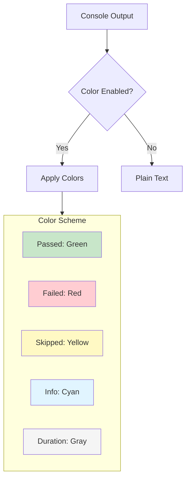

## JSON Reporter

### JSON Output Format

```json
{
  "version": "1.0",
  "timestamp": "2025-11-18T12:00:00Z",
  "suite": "tests/",
  "total": 5,
  "passed": 4,
  "failed": 1,
  "skipped": 0,
  "error": 0,
  "duration_ms": 6000,
  "pass_rate": 0.8,
  "tests": [
    {
      "name": "tests/login_test.rs::test_admin_login",
      "status": "passed",
      "duration_ms": 1200
    },
    {
      "name": "tests/checkout_test.rs::test_add_to_cart",
      "status": "failed",
      "duration_ms": 2100,
      "error": {
        "message": "Element not found: button[name=\"Add to Cart\"]",
        "location": "tests/checkout_test.rs:15",
        "suggestion": "Check if the button exists in the page."
      }
    }
  ]
}
```

### JSON Structure

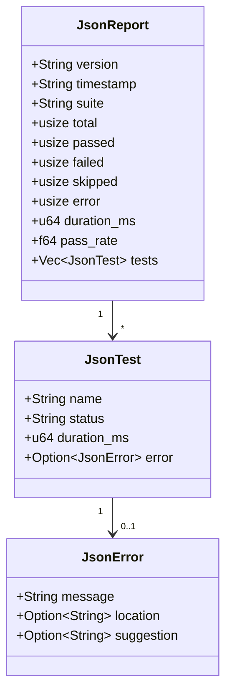

## JUnit Reporter

### JUnit XML Format

```xml
<?xml version="1.0" encoding="UTF-8"?>
<testsuites tests="5" failures="1" errors="0" time="6.0">
  <testsuite name="ui-test-rs" tests="5" failures="1" errors="0" time="6.0" timestamp="2025-11-18T12:00:00Z">
    <testcase name="test_admin_login" classname="tests.login_test" time="1.2"/>
    <testcase name="test_user_login" classname="tests.login_test" time="0.8"/>
    <testcase name="test_add_to_cart" classname="tests.checkout_test" time="2.1">
      <failure message="Element not found">
        Error: Element not found: button[name="Add to Cart"]
        at tests/checkout_test.rs:15

        Suggestion: Check if the button exists in the page.
        Try: Take a screenshot to debug: ctx.screenshot("debug.png")
      </failure>
    </testcase>
    <testcase name="test_remove_item" classname="tests.checkout_test" time="1.0"/>
    <testcase name="test_search" classname="tests.search_test" time="0.9"/>
  </testsuite>
</testsuites>
```

### JUnit Structure

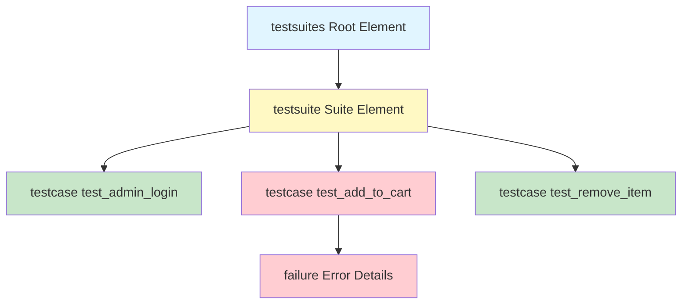

## Statistics Calculation

### Metrics Calculation

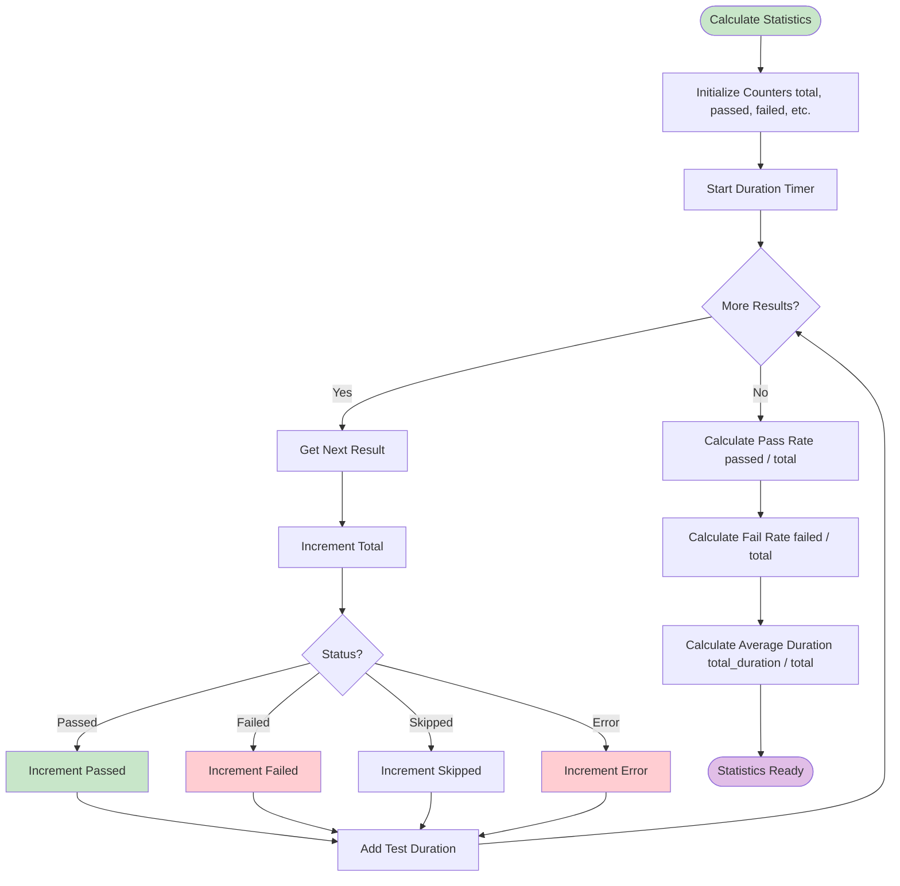

### Statistics Structure

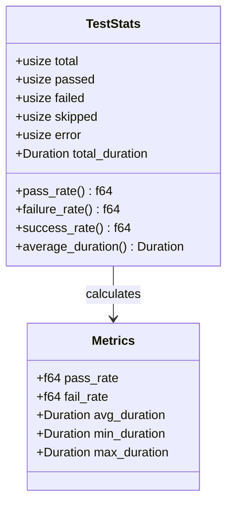

## Error Message Formatting

### Error Format

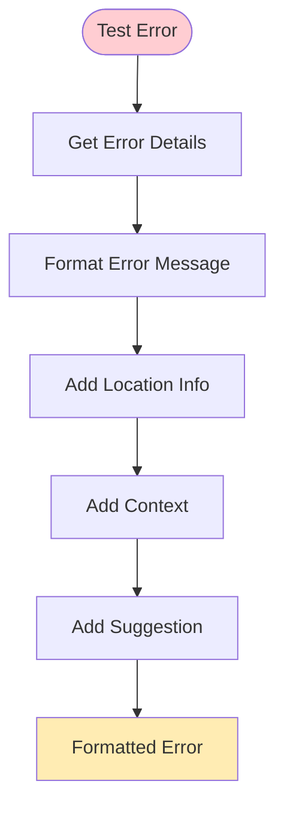

### Error Message Example

```
---- tests/checkout_test.rs::test_add_to_cart ----
Error: Element not found: button[name="Add to Cart"]
  at tests/checkout_test.rs:15

  Context: Looking for element with selector: button[name="Add to Cart"]
  Page: https://example.com/checkout

  Suggestion: Check if the button exists in the page.
  Try: Take a screenshot to debug: ctx.screenshot("debug.png")
```

## Verbose Mode

### Verbose Output

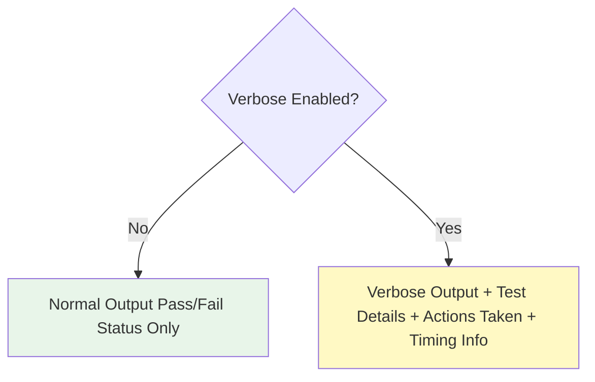

### Verbose Output Example

```
test tests/login_test.rs::test_admin_login ...
  [00:00.123] Navigate to https://example.com/login
  [00:00.456] Fill input[name='username'] with 'admin'
  [00:00.678] Fill input[name='password'] with 'secret'
  [00:00.890] Click button[name='Submit']
  [00:01.123] Assert URL contains '/dashboard'
ok (1.2s)
```

## Output Destination

### Output Flow

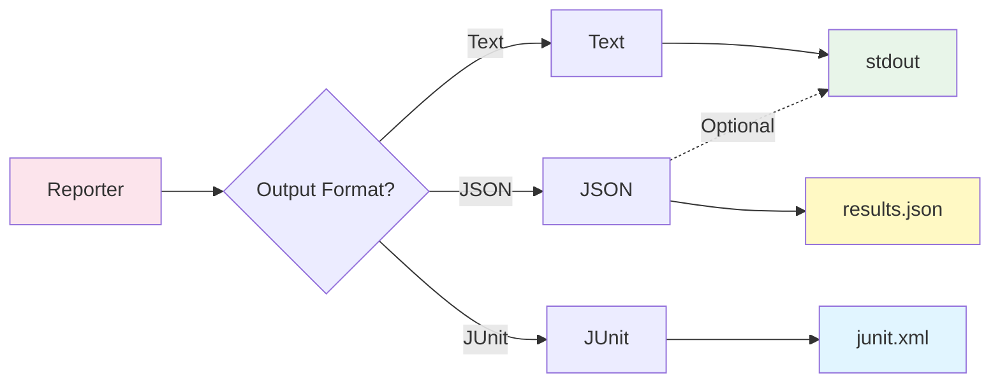

## Usage Examples

### Text Reporter

```rust
let reporter = TextReporter::new(verbose: true, color: true);
reporter.report_start(&suite);

for result in results {
    reporter.report_test(&result);
}

reporter.report_end(&stats);
```

### JSON Reporter

```rust
let reporter = JsonReporter::new(Some(PathBuf::from("results.json")));
reporter.report_start(&suite);

for result in results {
    reporter.report_test(&result);
}

reporter.report_end(&stats);
```

### JUnit Reporter

```rust
let reporter = JunitReporter::new(PathBuf::from("junit.xml"));
reporter.report_start(&suite);

for result in results {
    reporter.report_test(&result);
}

reporter.report_end(&stats);
```

## CI/CD Integration

### CI/CD Output Flow

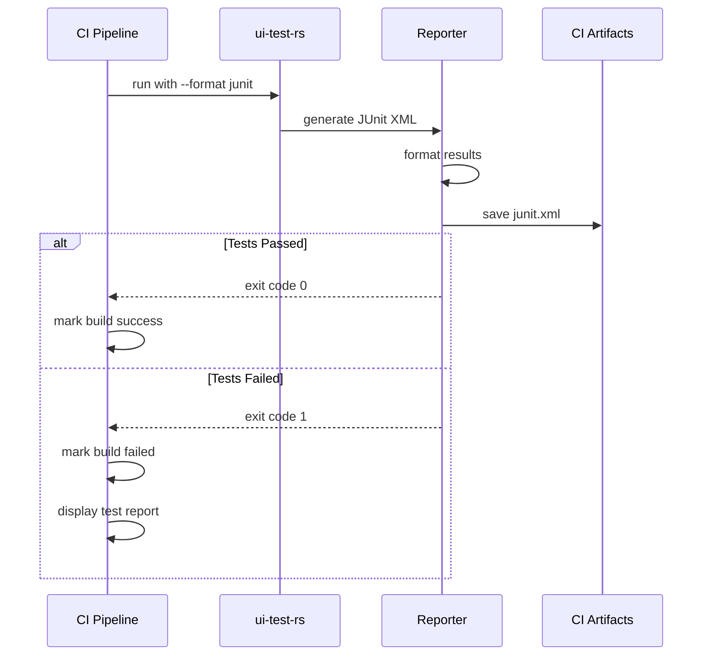

## Related Documentation

- [Test Runner](Test-Runner) - Test execution
- [CLI Interface](CLI-Interface) - Command-line interface
- [Architecture](Architecture) - System architecture
- [Configuration](Configuration) - Configuration system

---

**Last Updated:** 2025-11-18
