# Sequences and Flows

This page documents the key sequences and data flows in ui-test-rs, showing how components interact during different operations.

## Table of Contents

- [Application Startup](#application-startup)
- [Test Discovery](#test-discovery)
- [Test Execution](#test-execution)
- [Browser Actions](#browser-actions)
- [Result Reporting](#result-reporting)
- [Error Handling](#error-handling)
- [Configuration Resolution](#configuration-resolution)

## Application Startup

### Full Startup Sequence

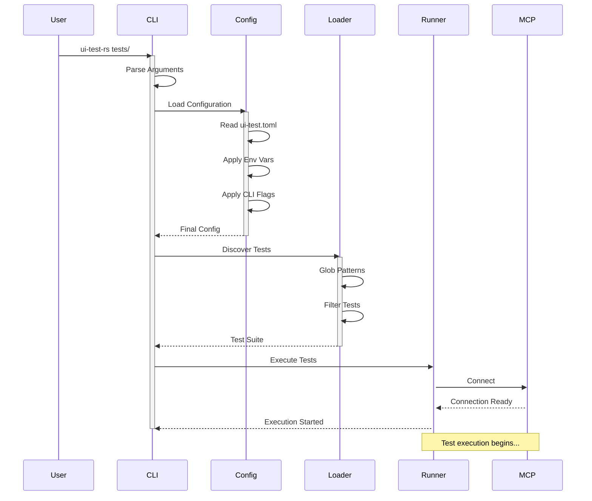
```mermaid
sequenceDiagram
    participant User
    participant CLI
    participant Config
    participant Loader
    participant Runner
    participant MCP

    User->>CLI: ui-test-rs tests/
    activate CLI

    CLI->>CLI: Parse Arguments
    CLI->>Config: Load Configuration
    activate Config
    Config->>Config: Read ui-test.toml
    Config->>Config: Apply Env Vars
    Config->>Config: Apply CLI Flags
    Config-->>CLI: Final Config
    deactivate Config

    CLI->>Loader: Discover Tests
    activate Loader
    Loader->>Loader: Glob Patterns
    Loader->>Loader: Filter Tests
    Loader-->>CLI: Test Suite
    deactivate Loader

    CLI->>Runner: Execute Tests
    activate Runner
    Runner->>MCP: Connect
    activate MCP
    MCP-->>Runner: Connection Ready
    Runner-->>CLI: Execution Started
    deactivate CLI

    Note over Runner,MCP: Test execution begins...
```

### Initialization Flow

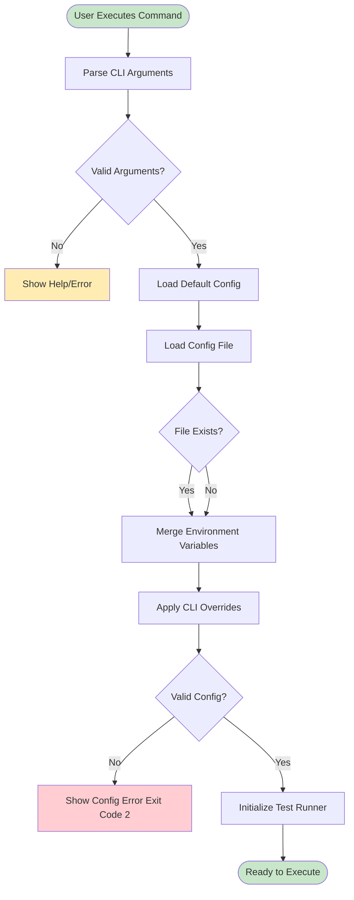
```mermaid
flowchart TB
    Start([User Executes Command])
    ParseArgs[Parse CLI Arguments]
    ValidateArgs{Valid Arguments?}
    ShowHelp[Show Help/Error]
    LoadDefaults[Load Default Config]
    LoadFile[Load Config File]
    FileExists{File Exists?}
    MergeEnv[Merge Environment Variables]
    ApplyCLI[Apply CLI Overrides]
    ValidateConfig{Valid Config?}
    ConfigError[Show Config Error Exit Code 2]
    InitRunner[Initialize Test Runner]
    Success([Ready to Execute])

    Start --> ParseArgs
    ParseArgs --> ValidateArgs
    ValidateArgs -->|No| ShowHelp
    ValidateArgs -->|Yes| LoadDefaults
    LoadDefaults --> LoadFile
    LoadFile --> FileExists
    FileExists -->|Yes| MergeEnv
    FileExists -->|No| MergeEnv
    MergeEnv --> ApplyCLI
    ApplyCLI --> ValidateConfig
    ValidateConfig -->|No| ConfigError
    ValidateConfig -->|Yes| InitRunner
    InitRunner --> Success

    style Start fill:#c8e6c9
    style ShowHelp fill:#ffecb3
    style ConfigError fill:#ffcdd2
    style Success fill:#c8e6c9
```

## Test Discovery

### Discovery Process

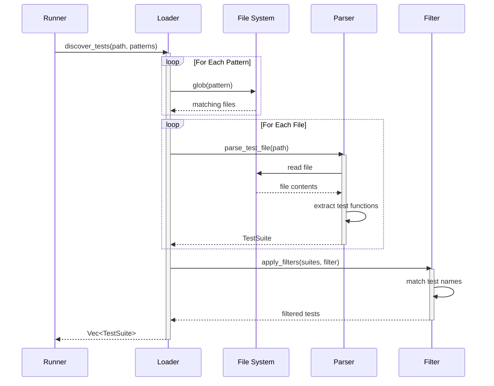
```mermaid
sequenceDiagram
    participant Runner
    participant Loader
    participant FS as File System
    participant Parser
    participant Filter

    Runner->>Loader: discover_tests(path, patterns)
    activate Loader

    loop For Each Pattern
        Loader->>FS: glob(pattern)
        FS-->>Loader: matching files
    end

    loop For Each File
        Loader->>Parser: parse_test_file(path)
        activate Parser
        Parser->>FS: read file
        FS-->>Parser: file contents
        Parser->>Parser: extract test functions
        Parser-->>Loader: TestSuite
        deactivate Parser
    end

    Loader->>Filter: apply_filters(suites, filter)
    activate Filter
    Filter->>Filter: match test names
    Filter-->>Loader: filtered tests
    deactivate Filter

    Loader-->>Runner: Vec<TestSuite>
    deactivate Loader
```

### Discovery Flow Chart

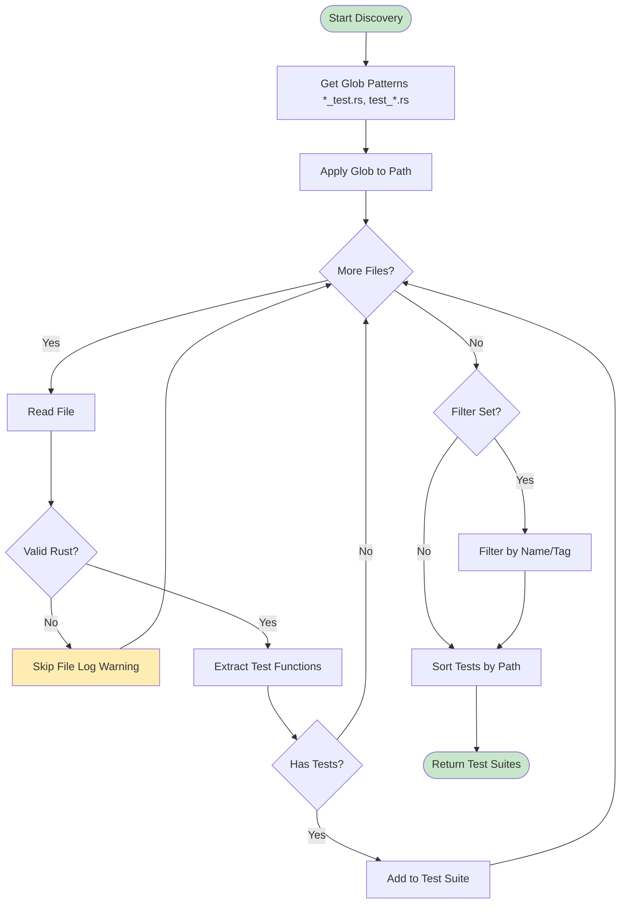
```mermaid
flowchart TB
    Start([Start Discovery])
    GetPatterns[Get Glob Patterns *_test.rs, test_*.rs]
    GlobFiles[Apply Glob to Path]
    MoreFiles{More Files?}
    ReadFile[Read File]
    ValidRust{Valid Rust?}
    SkipFile[Skip File Log Warning]
    ParseTests[Extract Test Functions]
    HasTests{Has Tests?}
    AddSuite[Add to Test Suite]
    ApplyFilter{Filter Set?}
    FilterTests[Filter by Name/Tag]
    SortTests[Sort Tests by Path]
    Done([Return Test Suites])

    Start --> GetPatterns
    GetPatterns --> GlobFiles
    GlobFiles --> MoreFiles
    MoreFiles -->|Yes| ReadFile
    MoreFiles -->|No| ApplyFilter
    ReadFile --> ValidRust
    ValidRust -->|No| SkipFile
    ValidRust -->|Yes| ParseTests
    SkipFile --> MoreFiles
    ParseTests --> HasTests
    HasTests -->|No| MoreFiles
    HasTests -->|Yes| AddSuite
    AddSuite --> MoreFiles
    ApplyFilter -->|Yes| FilterTests
    ApplyFilter -->|No| SortTests
    FilterTests --> SortTests
    SortTests --> Done

    style Start fill:#c8e6c9
    style SkipFile fill:#ffecb3
    style Done fill:#c8e6c9
```

## Test Execution

### Single Test Execution

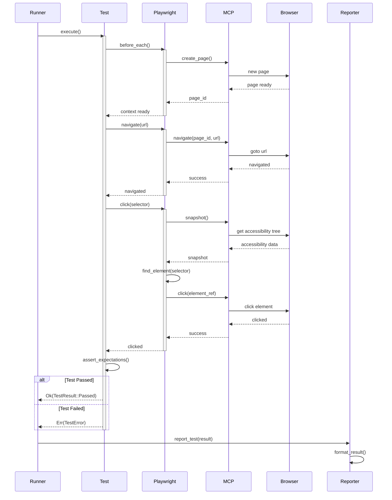
```mermaid
sequenceDiagram
    participant Runner
    participant Test
    participant PW as Playwright
    participant MCP
    participant Browser
    participant Reporter

    Runner->>Test: execute()
    activate Test

    Test->>PW: before_each()
    activate PW
    PW->>MCP: create_page()
    MCP->>Browser: new page
    Browser-->>MCP: page ready
    MCP-->>PW: page_id
    PW-->>Test: context ready
    deactivate PW

    Test->>PW: navigate(url)
    activate PW
    PW->>MCP: navigate(page_id, url)
    MCP->>Browser: goto url
    Browser-->>MCP: navigated
    MCP-->>PW: success
    PW-->>Test: navigated
    deactivate PW

    Test->>PW: click(selector)
    activate PW
    PW->>MCP: snapshot()
    MCP->>Browser: get accessibility tree
    Browser-->>MCP: accessibility data
    MCP-->>PW: snapshot
    PW->>PW: find_element(selector)
    PW->>MCP: click(element_ref)
    MCP->>Browser: click element
    Browser-->>MCP: clicked
    MCP-->>PW: success
    PW-->>Test: clicked
    deactivate PW

    Test->>Test: assert_expectations()

    alt Test Passed
        Test-->>Runner: Ok(TestResult::Passed)
    else Test Failed
        Test-->>Runner: Err(TestError)
    end

    deactivate Test

    Runner->>Reporter: report_test(result)
    Reporter->>Reporter: format_result()
```

### Parallel Execution

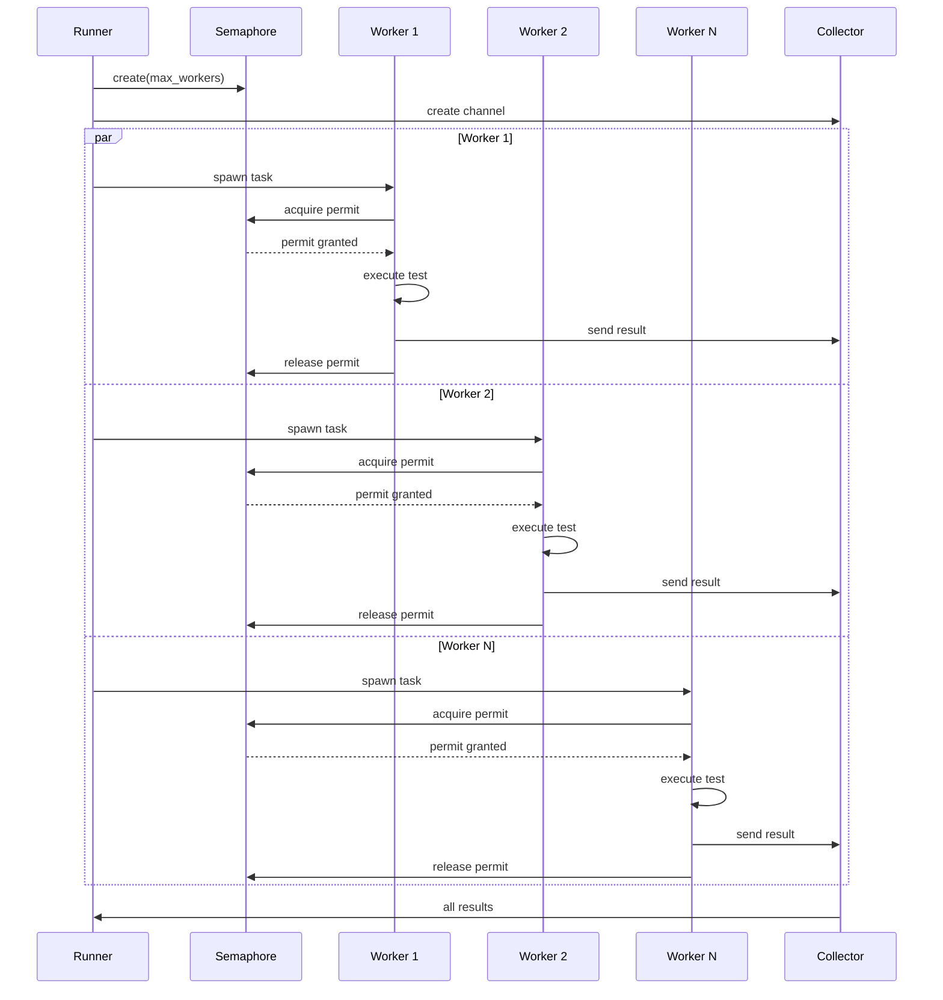
```mermaid
sequenceDiagram
    participant Runner
    participant Semaphore
    participant W1 as Worker 1
    participant W2 as Worker 2
    participant WN as Worker N
    participant Collector

    Runner->>Semaphore: create(max_workers)
    Runner->>Collector: create channel

    par Worker 1
        Runner->>W1: spawn task
        W1->>Semaphore: acquire permit
        Semaphore-->>W1: permit granted
        W1->>W1: execute test
        W1->>Collector: send result
        W1->>Semaphore: release permit
    and Worker 2
        Runner->>W2: spawn task
        W2->>Semaphore: acquire permit
        Semaphore-->>W2: permit granted
        W2->>W2: execute test
        W2->>Collector: send result
        W2->>Semaphore: release permit
    and Worker N
        Runner->>WN: spawn task
        WN->>Semaphore: acquire permit
        Semaphore-->>WN: permit granted
        WN->>WN: execute test
        WN->>Collector: send result
        WN->>Semaphore: release permit
    end

    Collector->>Runner: all results
```

### Test Lifecycle

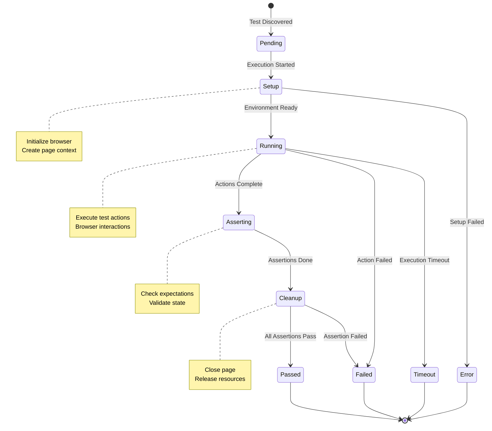
```mermaid
stateDiagram-v2
    [*] --> Pending: Test Discovered
    Pending --> Setup: Execution Started
    Setup --> Running: Environment Ready
    Running --> Asserting: Actions Complete
    Asserting --> Cleanup: Assertions Done
    Cleanup --> Passed: All Assertions Pass
    Cleanup --> Failed: Assertion Failed
    Running --> Failed: Action Failed
    Running --> Timeout: Execution Timeout
    Setup --> Error: Setup Failed

    Passed --> [*]
    Failed --> [*]
    Timeout --> [*]
    Error --> [*]

    note right of Setup
        Initialize browser
        Create page context
    end note

    note right of Running
        Execute test actions
        Browser interactions
    end note

    note right of Asserting
        Check expectations
        Validate state
    end note

    note right of Cleanup
        Close page
        Release resources
    end note
```

## Browser Actions

### Navigate Action

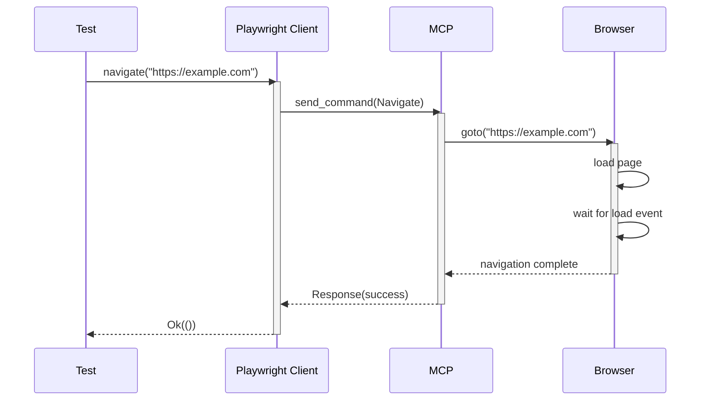
```mermaid
sequenceDiagram
    participant Test
    participant PW as Playwright Client
    participant MCP
    participant Browser

    Test->>PW: navigate("https://example.com")
    activate PW

    PW->>MCP: send_command(Navigate)
    activate MCP

    MCP->>Browser: goto("https://example.com")
    activate Browser

    Browser->>Browser: load page
    Browser->>Browser: wait for load event

    Browser-->>MCP: navigation complete
    deactivate Browser

    MCP-->>PW: Response(success)
    deactivate MCP

    PW-->>Test: Ok(())
    deactivate PW
```

### Click Action with Element Selection

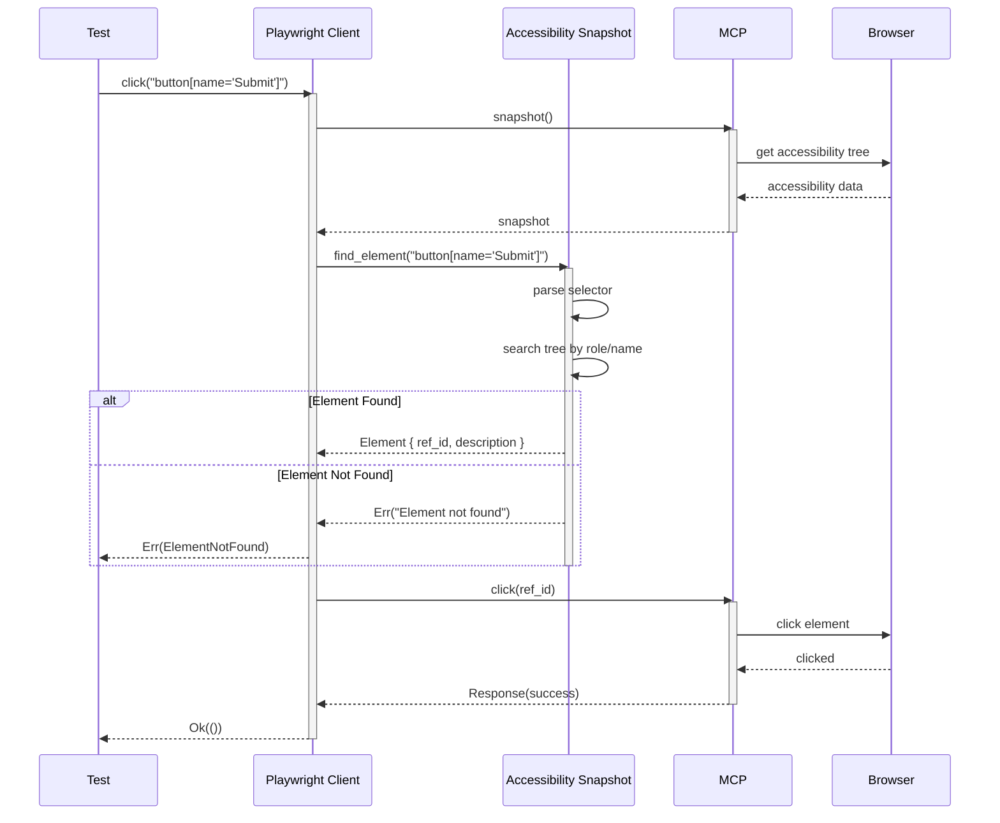
```mermaid
sequenceDiagram
    participant Test
    participant PW as Playwright Client
    participant Snapshot as Accessibility Snapshot
    participant MCP
    participant Browser

    Test->>PW: click("button[name='Submit']")
    activate PW

    PW->>MCP: snapshot()
    activate MCP
    MCP->>Browser: get accessibility tree
    Browser-->>MCP: accessibility data
    MCP-->>PW: snapshot
    deactivate MCP

    PW->>Snapshot: find_element("button[name='Submit']")
    activate Snapshot
    Snapshot->>Snapshot: parse selector
    Snapshot->>Snapshot: search tree by role/name

    alt Element Found
        Snapshot-->>PW: Element { ref_id, description }
    else Element Not Found
        Snapshot-->>PW: Err("Element not found")
        PW-->>Test: Err(ElementNotFound)
    end
    deactivate Snapshot

    PW->>MCP: click(ref_id)
    activate MCP
    MCP->>Browser: click element
    Browser-->>MCP: clicked
    MCP-->>PW: Response(success)
    deactivate MCP

    PW-->>Test: Ok(())
    deactivate PW
```

### Fill Text Action

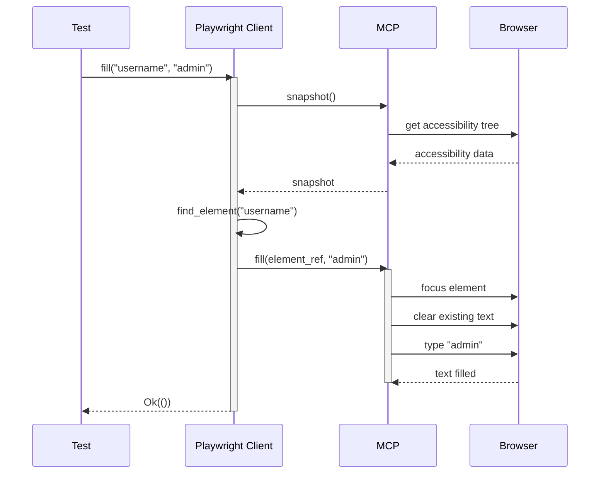
```mermaid
sequenceDiagram
    participant Test
    participant PW as Playwright Client
    participant MCP
    participant Browser

    Test->>PW: fill("username", "admin")
    activate PW

    PW->>MCP: snapshot()
    MCP->>Browser: get accessibility tree
    Browser-->>MCP: accessibility data
    MCP-->>PW: snapshot

    PW->>PW: find_element("username")
    PW->>MCP: fill(element_ref, "admin")
    activate MCP

    MCP->>Browser: focus element
    MCP->>Browser: clear existing text
    MCP->>Browser: type "admin"

    Browser-->>MCP: text filled
    deactivate MCP

    PW-->>Test: Ok(())
    deactivate PW
```

## Result Reporting

### Report Generation Flow

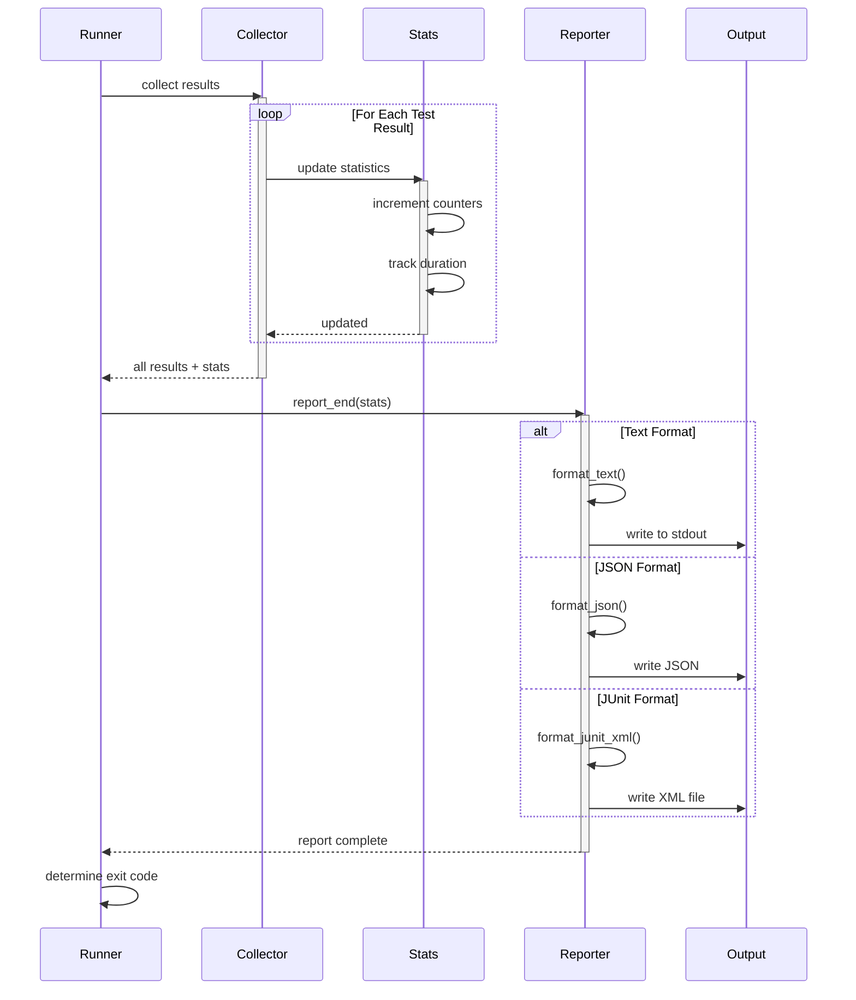
```mermaid
sequenceDiagram
    participant Runner
    participant Collector
    participant Stats
    participant Reporter
    participant Output

    Runner->>Collector: collect results
    activate Collector

    loop For Each Test Result
        Collector->>Stats: update statistics
        activate Stats
        Stats->>Stats: increment counters
        Stats->>Stats: track duration
        Stats-->>Collector: updated
        deactivate Stats
    end

    Collector-->>Runner: all results + stats
    deactivate Collector

    Runner->>Reporter: report_end(stats)
    activate Reporter

    alt Text Format
        Reporter->>Reporter: format_text()
        Reporter->>Output: write to stdout
    else JSON Format
        Reporter->>Reporter: format_json()
        Reporter->>Output: write JSON
    else JUnit Format
        Reporter->>Reporter: format_junit_xml()
        Reporter->>Output: write XML file
    end

    Reporter-->>Runner: report complete
    deactivate Reporter

    Runner->>Runner: determine exit code
```

### Statistics Aggregation

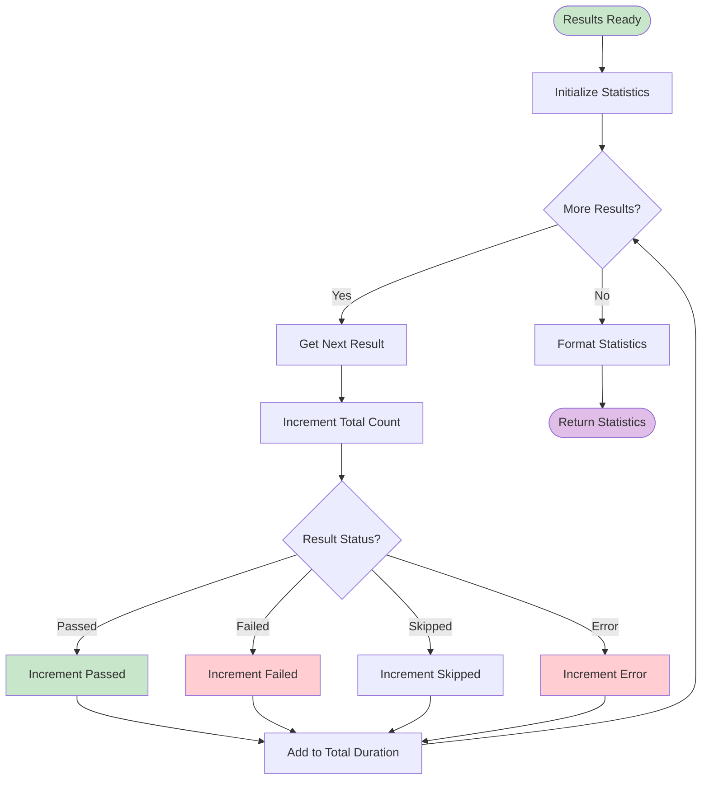
```mermaid
flowchart TB
    Start([Results Ready])
    InitStats[Initialize Statistics]
    MoreResults{More Results?}
    GetResult[Get Next Result]
    IncrementTotal[Increment Total Count]
    CheckStatus{Result Status?}
    IncrementPassed[Increment Passed]
    IncrementFailed[Increment Failed]
    IncrementSkipped[Increment Skipped]
    IncrementError[Increment Error]
    AddDuration[Add to Total Duration]
    FormatStats[Format Statistics]
    Done([Return Statistics])

    Start --> InitStats
    InitStats --> MoreResults
    MoreResults -->|Yes| GetResult
    MoreResults -->|No| FormatStats
    GetResult --> IncrementTotal
    IncrementTotal --> CheckStatus
    CheckStatus -->|Passed| IncrementPassed
    CheckStatus -->|Failed| IncrementFailed
    CheckStatus -->|Skipped| IncrementSkipped
    CheckStatus -->|Error| IncrementError
    IncrementPassed --> AddDuration
    IncrementFailed --> AddDuration
    IncrementSkipped --> AddDuration
    IncrementError --> AddDuration
    AddDuration --> MoreResults
    FormatStats --> Done

    style Start fill:#c8e6c9
    style IncrementPassed fill:#c8e6c9
    style IncrementFailed fill:#ffcdd2
    style IncrementError fill:#ffcdd2
    style Done fill:#e1bee7
```

## Error Handling

### Error Handling Sequence

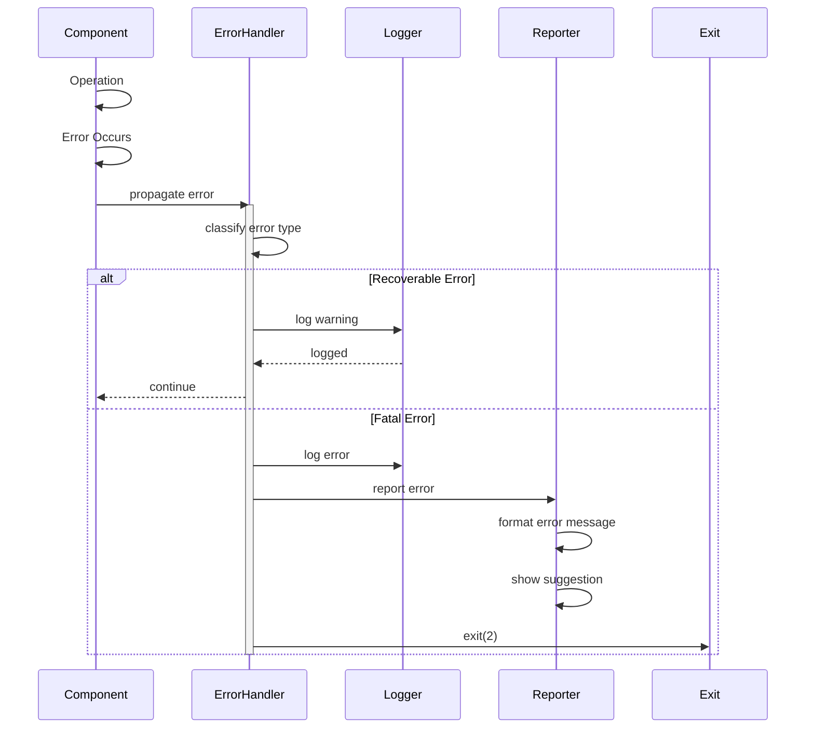
```mermaid
sequenceDiagram
    participant Component
    participant ErrorHandler
    participant Logger
    participant Reporter
    participant Exit

    Component->>Component: Operation
    Component->>Component: Error Occurs

    Component->>ErrorHandler: propagate error
    activate ErrorHandler

    ErrorHandler->>ErrorHandler: classify error type

    alt Recoverable Error
        ErrorHandler->>Logger: log warning
        Logger-->>ErrorHandler: logged
        ErrorHandler-->>Component: continue
    else Fatal Error
        ErrorHandler->>Logger: log error
        ErrorHandler->>Reporter: report error
        Reporter->>Reporter: format error message
        Reporter->>Reporter: show suggestion
        ErrorHandler->>Exit: exit(2)
    end

    deactivate ErrorHandler
```

### Error Recovery Flow

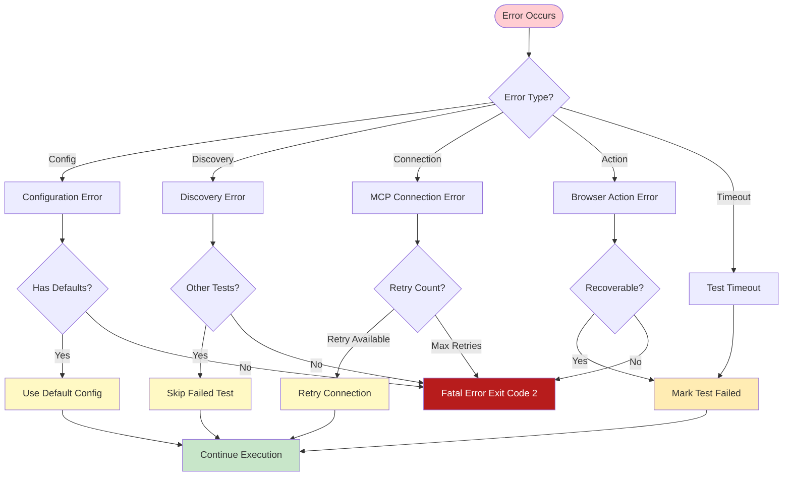
```mermaid
flowchart TB
    Error([Error Occurs])
    Classify{Error Type?}

    Config[Configuration Error]
    Discovery[Discovery Error]
    Connection[MCP Connection Error]
    BrowserAction[Browser Action Error]
    Timeout[Test Timeout]

    RecoverConfig{Has Defaults?}
    RecoverDiscovery{Other Tests?}
    RecoverConnection{Retry Count?}
    RecoverAction{Recoverable?}

    UseDefaults[Use Default Config]
    SkipTest[Skip Failed Test]
    Retry[Retry Connection]
    FailTest[Mark Test Failed]

    Fatal[Fatal Error Exit Code 2]
    Continue[Continue Execution]

    Error --> Classify

    Classify -->|Config| Config
    Classify -->|Discovery| Discovery
    Classify -->|Connection| Connection
    Classify -->|Action| BrowserAction
    Classify -->|Timeout| Timeout

    Config --> RecoverConfig
    RecoverConfig -->|Yes| UseDefaults
    RecoverConfig -->|No| Fatal
    UseDefaults --> Continue

    Discovery --> RecoverDiscovery
    RecoverDiscovery -->|Yes| SkipTest
    RecoverDiscovery -->|No| Fatal
    SkipTest --> Continue

    Connection --> RecoverConnection
    RecoverConnection -->|Retry Available| Retry
    RecoverConnection -->|Max Retries| Fatal
    Retry --> Continue

    BrowserAction --> RecoverAction
    RecoverAction -->|Yes| FailTest
    RecoverAction -->|No| Fatal
    FailTest --> Continue

    Timeout --> FailTest

    style Error fill:#ffcdd2
    style Fatal fill:#b71c1c,color:#fff
    style Continue fill:#c8e6c9
    style UseDefaults fill:#fff9c4
    style SkipTest fill:#fff9c4
    style Retry fill:#fff9c4
    style FailTest fill:#ffecb3
```

## Configuration Resolution

### Configuration Precedence

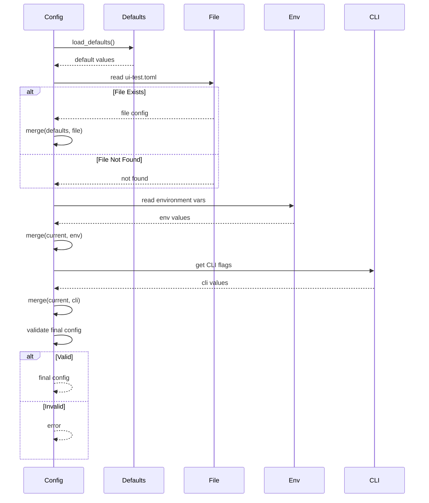
```mermaid
sequenceDiagram
    participant Config
    participant Defaults
    participant File
    participant Env
    participant CLI

    Config->>Defaults: load_defaults()
    Defaults-->>Config: default values

    Config->>File: read ui-test.toml
    alt File Exists
        File-->>Config: file config
        Config->>Config: merge(defaults, file)
    else File Not Found
        File-->>Config: not found
    end

    Config->>Env: read environment vars
    Env-->>Config: env values
    Config->>Config: merge(current, env)

    Config->>CLI: get CLI flags
    CLI-->>Config: cli values
    Config->>Config: merge(current, cli)

    Config->>Config: validate final config

    alt Valid
        Config-->>Config: final config
    else Invalid
        Config-->>Config: error
    end
```

### Configuration Merge Logic

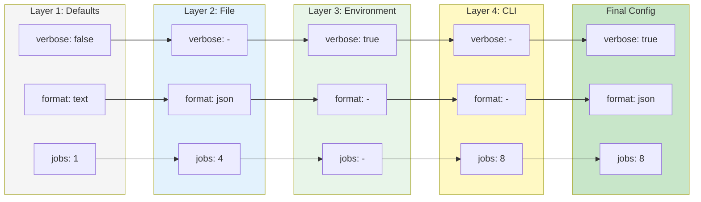
```mermaid
flowchart LR
    subgraph Layer1["Layer 1: Defaults"]
        D1[verbose: false]
        D2[format: text]
        D3[jobs: 1]
    end

    subgraph Layer2["Layer 2: File"]
        F1[verbose: -]
        F2[format: json]
        F3[jobs: 4]
    end

    subgraph Layer3["Layer 3: Environment"]
        E1[verbose: true]
        E2[format: -]
        E3[jobs: -]
    end

    subgraph Layer4["Layer 4: CLI"]
        C1[verbose: -]
        C2[format: -]
        C3[jobs: 8]
    end

    subgraph Final["Final Config"]
        R1[verbose: true]
        R2[format: json]
        R3[jobs: 8]
    end

    D1 --> F1
    F1 --> E1
    E1 --> C1
    C1 --> R1

    D2 --> F2
    F2 --> E2
    E2 --> C2
    C2 --> R2

    D3 --> F3
    F3 --> E3
    E3 --> C3
    C3 --> R3

    style Layer1 fill:#f5f5f5
    style Layer2 fill:#e3f2fd
    style Layer3 fill:#e8f5e9
    style Layer4 fill:#fff9c4
    style Final fill:#c8e6c9
```

## Related Documentation

- [Architecture](Architecture) - System architecture and components
- [Configuration](Configuration) - Configuration system details
- [CLI Interface](CLI-Interface) - CLI component
- [Test Runner](Test-Runner) - Runner component
- [Playwright Client](Playwright-Client) - Browser automation

---

**Last Updated:** 2025-11-18
