# Test Loader

The Test Loader component (`loader.rs`) is responsible for discovering test files, parsing test metadata, and building a test execution plan.

## Overview

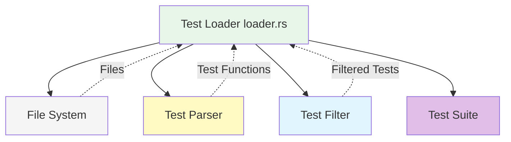

## Responsibilities

- Discover test files using glob patterns
- Parse test file metadata
- Extract test functions and their attributes
- Filter tests by name or tags
- Build test execution plan
- Validate test structure

## Structure

### TestLoader Struct

```rust
struct TestLoader {
    patterns: Vec<String>,
    exclude: Vec<String>,
    root_path: PathBuf,
}

impl TestLoader {
    fn new(root: PathBuf, patterns: Vec<String>) -> Self;
    fn discover_tests(&self) -> Result<Vec<TestSuite>>;
    fn apply_filter(&self, suites: Vec<TestSuite>, filter: &str) -> Vec<TestSuite>;
}
```

### Component Diagram

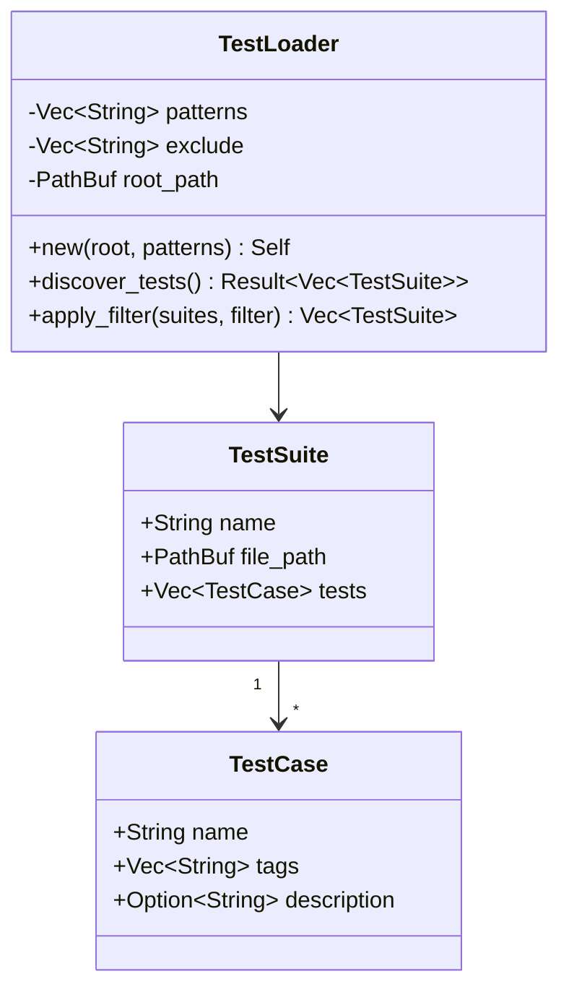

## Discovery Process

### Discovery Flow

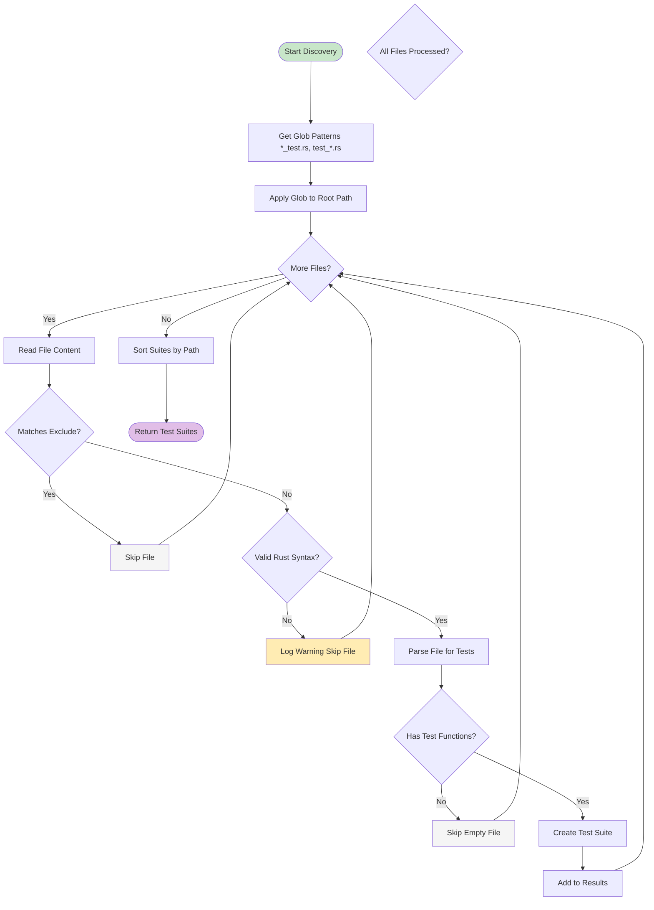

### Discovery Sequence

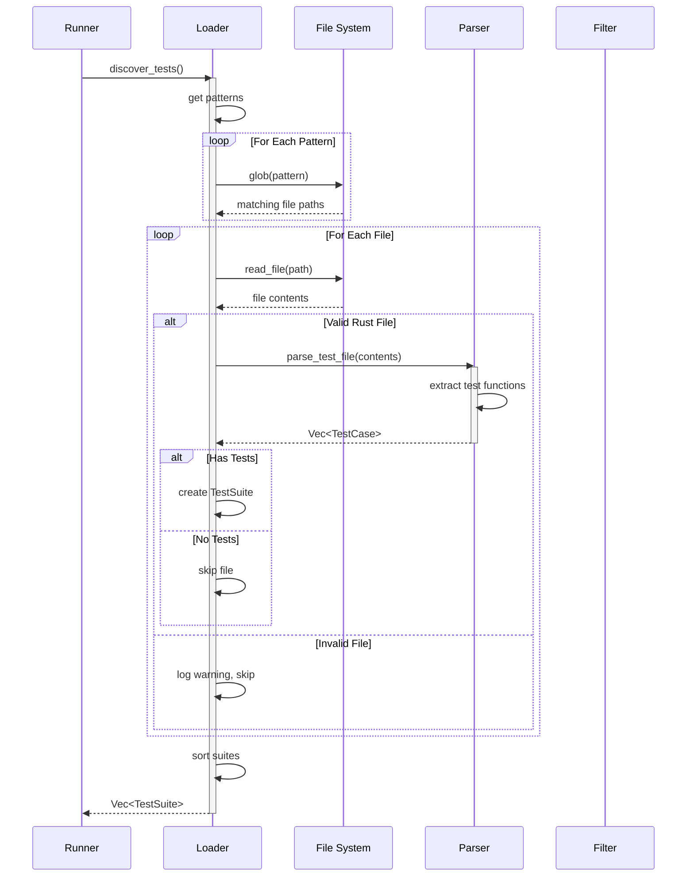

## Test File Patterns

### Supported Patterns

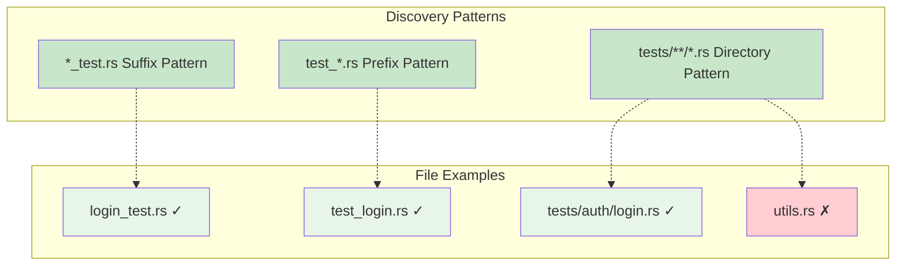

### Exclude Patterns

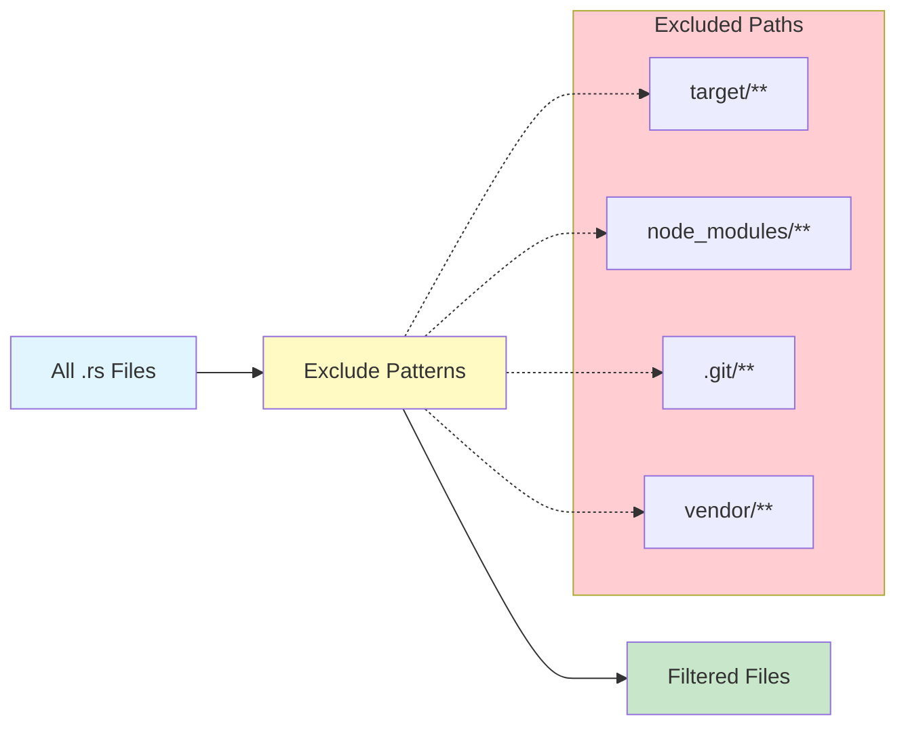

## Test Parsing

### Parsing Process

```mermaid
flowchart TB
    Start([File Content])
    Tokenize[Tokenize Rust Code]
    FindFunctions[Find Function Definitions]
    MoreFuncs{More Functions?}

    CheckAttrs[Check Attributes]
    HasTestAttr{Has #[test] or #[test_case]?}
    SkipFunc[Skip Function]

    ExtractName[Extract Function Name]
    ExtractTags[Extract Tags from Attrs]
    ExtractDesc[Extract Description]

    CreateTestCase[Create TestCase]
    AddToSuite[Add to Test Suite]

    Done([Test Cases Extracted])

    Start --> Tokenize
    Tokenize --> FindFunctions
    FindFunctions --> MoreFuncs

    MoreFuncs -->|Yes| CheckAttrs
    MoreFuncs -->|No| Done

    CheckAttrs --> HasTestAttr
    HasTestAttr -->|No| SkipFunc
    HasTestAttr -->|Yes| ExtractName

    SkipFunc --> MoreFuncs

    ExtractName --> ExtractTags
    ExtractTags --> ExtractDesc
    ExtractDesc --> CreateTestCase
    CreateTestCase --> AddToSuite
    AddToSuite --> MoreFuncs

    style Start fill:#c8e6c9
    style Done fill:#e1bee7
    style SkipFunc fill:#f5f5f5
```

### Test Attributes

```rust
// Example test file with attributes
use ui_test_rs::prelude::*;

/// Tests user login functionality
#[test_case("login_admin")]
#[tags("smoke", "auth")]
async fn test_admin_login(ctx: &mut TestContext) -> Result<()> {
    // Test implementation
    Ok(())
}

#[test_case("login_invalid")]
#[tags("auth", "negative")]
async fn test_invalid_credentials(ctx: &mut TestContext) -> Result<()> {
    // Test implementation
    Ok(())
}
```

### Attribute Diagram

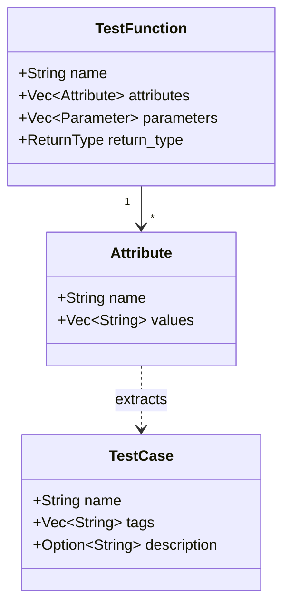

## Test Filtering

### Filter Types

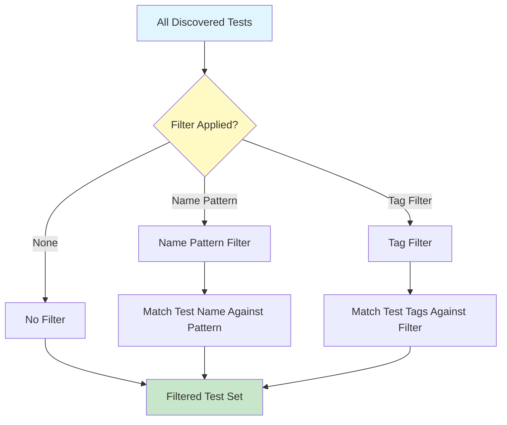

### Filter Examples

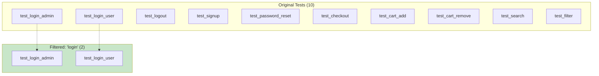

### Filter Algorithm

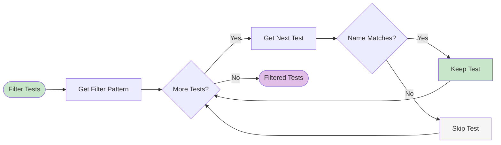

## Test Suite Structure

### Suite Hierarchy

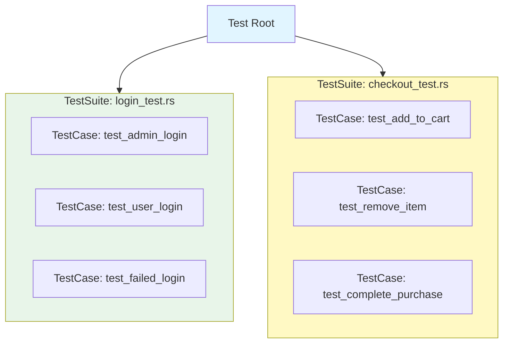

## Error Handling

### Discovery Errors

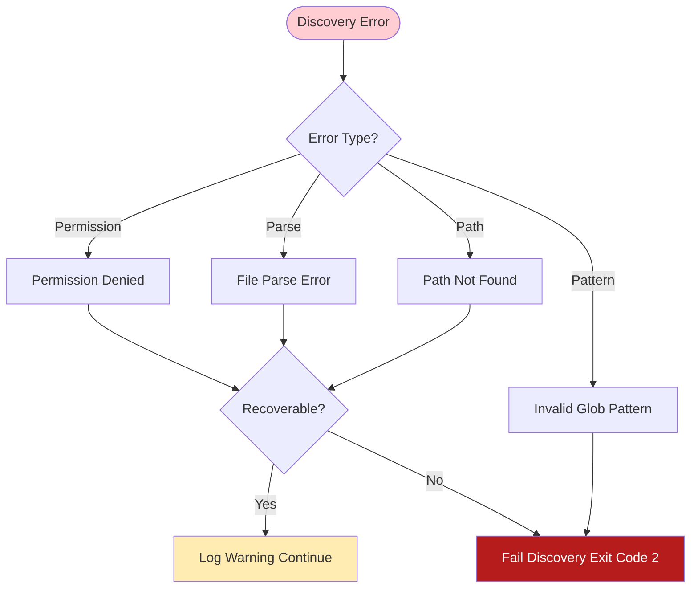

## Performance Optimization

### Parallel Discovery

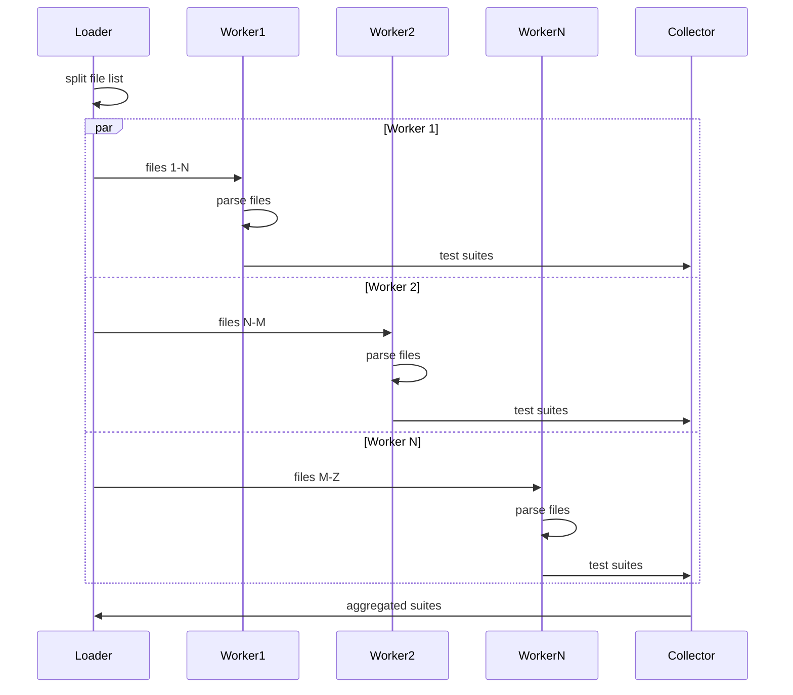

## Configuration

### Loader Configuration

```rust
struct LoaderConfig {
    patterns: Vec<String>,
    exclude: Vec<String>,
    follow_symlinks: bool,
    max_depth: Option<usize>,
}
```

## Usage Examples

### Basic Discovery

```rust
let loader = TestLoader::new(
    PathBuf::from("tests"),
    vec!["*_test.rs".to_string(), "test_*.rs".to_string()],
);

let suites = loader.discover_tests()?;
```

### With Filtering

```rust
let loader = TestLoader::new(root, patterns);
let suites = loader.discover_tests()?;
let filtered = loader.apply_filter(suites, "login");
```

## Validation

### Test Suite Validation

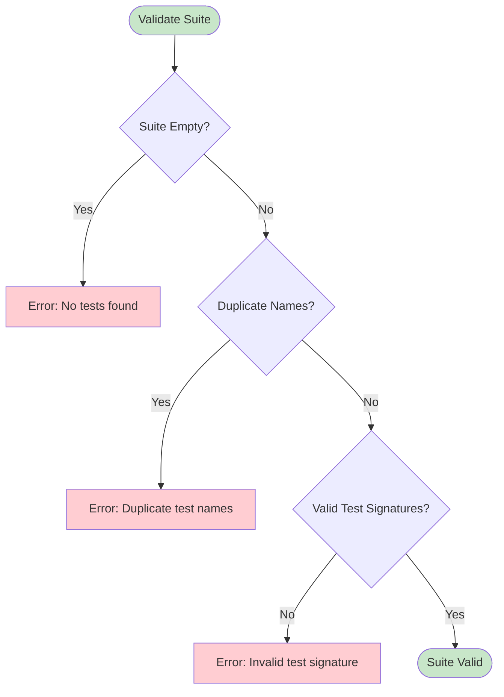

## Related Documentation

- [Test Runner](Test-Runner) - Test execution
- [CLI Interface](CLI-Interface) - Command-line interface
- [Configuration](Configuration) - Configuration system
- [Architecture](Architecture) - System architecture
- [Sequences](Sequences) - Data flows

---

**Last Updated:** 2025-11-18
