# Test Runner

The Test Runner component (`runner.rs`) orchestrates the entire test execution lifecycle, managing test execution, coordinating with other components, and collecting results.

## Overview

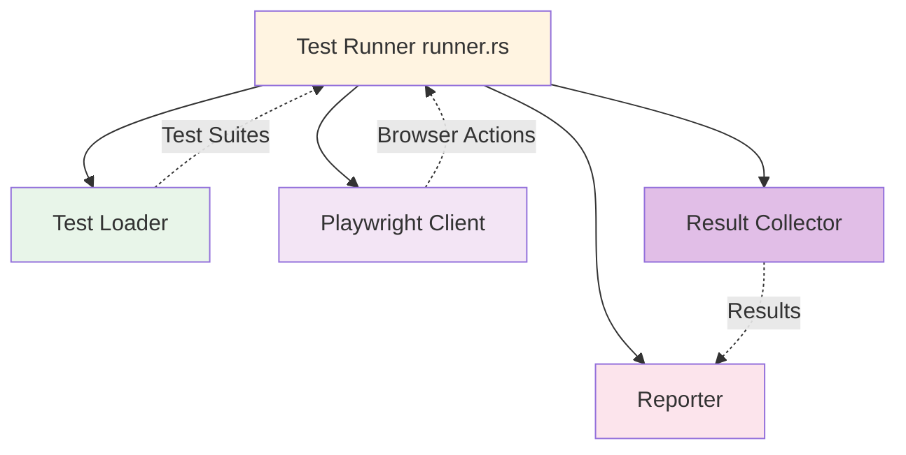

## Responsibilities

- Orchestrate test execution lifecycle
- Manage test execution (sequential or parallel)
- Coordinate between Loader, Playwright, and Reporter
- Handle test timeouts
- Collect and aggregate results
- Determine final exit code

## Structure

### TestRunner Struct

```rust
struct TestRunner {
    config: Config,
    playwright: PlaywrightClient,
    reporter: Box<dyn Reporter>,
}

impl TestRunner {
    fn new(config: Config) -> Result<Self>;
    async fn run(&mut self, test_path: PathBuf) -> Result<TestStats>;
    async fn execute_test(&self, test: &TestCase) -> TestResult;
}
```

### Component Diagram

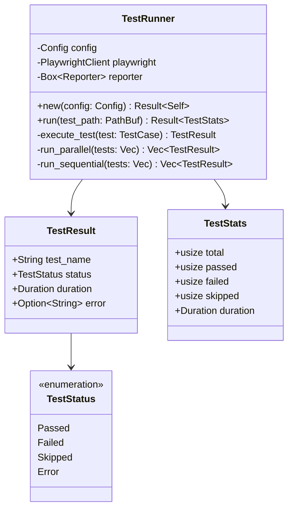

## Execution Lifecycle

### Full Test Execution Flow

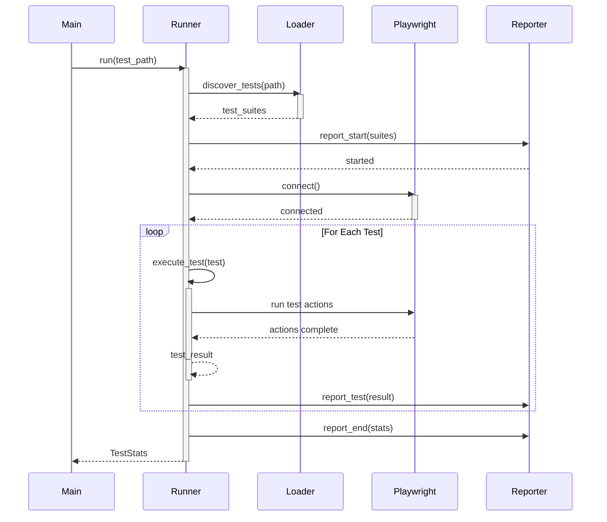

### Execution State Machine

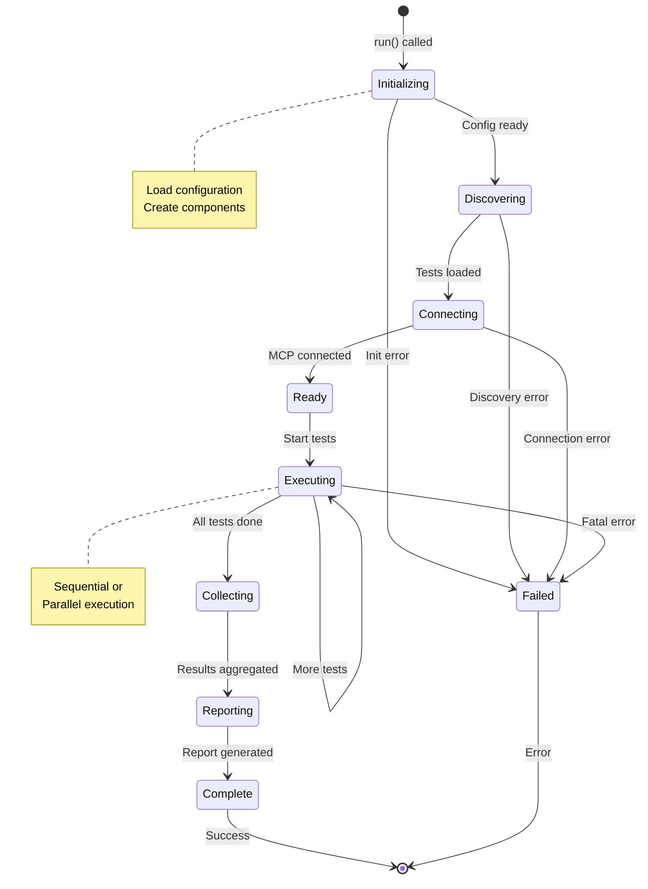

## Execution Modes

### Sequential Execution

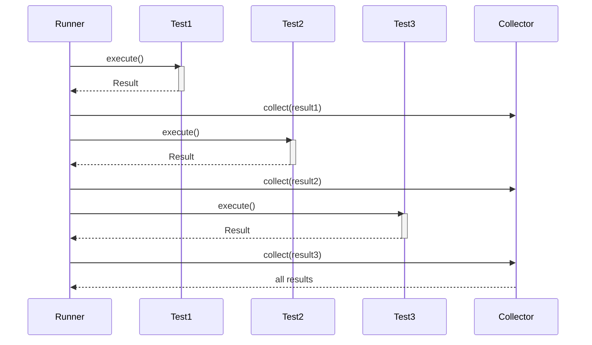

### Parallel Execution

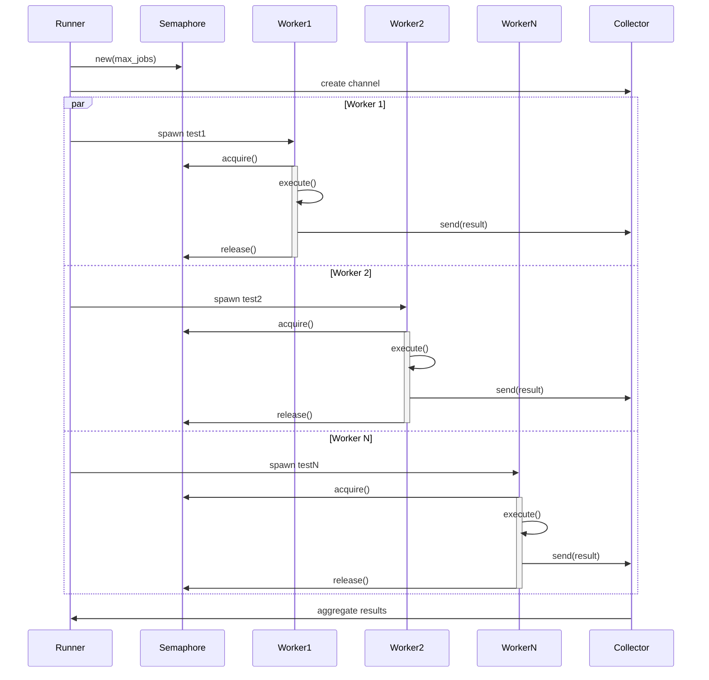

### Execution Mode Comparison

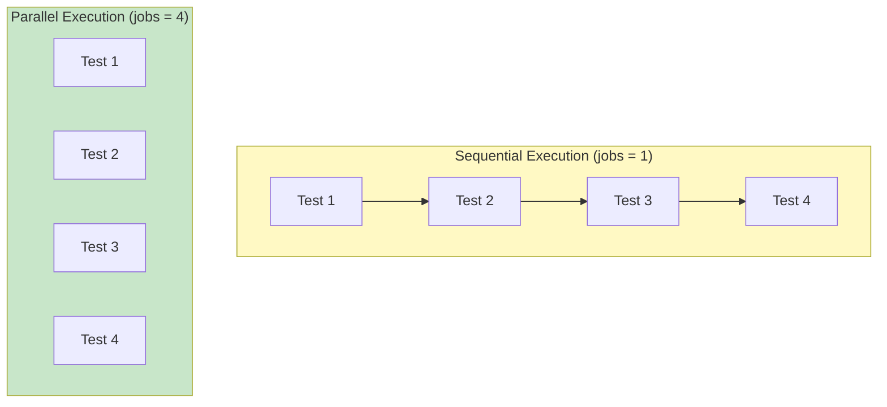

## Test Lifecycle Management

### Per-Test Lifecycle

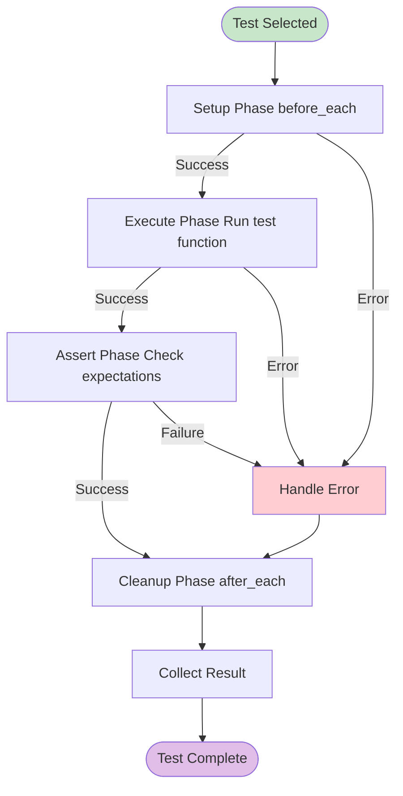

### Resource Management

```mermaid
sequenceDiagram
    participant Runner
    participant Browser
    participant Resources

    Runner->>Browser: initialize()
    activate Browser
    Runner->>Resources: allocate()
    activate Resources

    loop Test Execution
        Runner->>Browser: use browser
        Runner->>Resources: use resources
    end

    alt Normal Completion
        Runner->>Resources: cleanup()
        deactivate Resources
        Runner->>Browser: close()
        deactivate Browser
    else Error or Timeout
        Runner->>Resources: force cleanup()
        deactivate Resources
        Runner->>Browser: force close()
        deactivate Browser
    end
```

## Timeout Handling

### Timeout Architecture

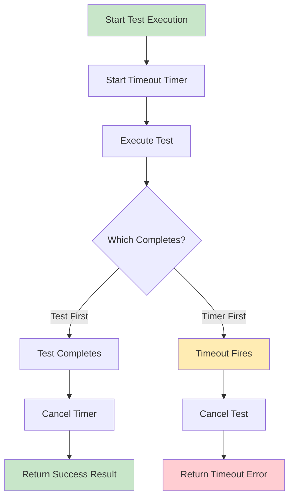

### Timeout Implementation

```rust
async fn execute_with_timeout(
    test: &TestCase,
    timeout: Duration,
) -> TestResult {
    match tokio::time::timeout(timeout, execute_test(test)).await {
        Ok(result) => result,
        Err(_) => TestResult {
            test_name: test.name.clone(),
            status: TestStatus::Error,
            duration: timeout,
            error: Some(format!("Test timed out after {:?}", timeout)),
        },
    }
}
```

## Result Collection

### Collection Process

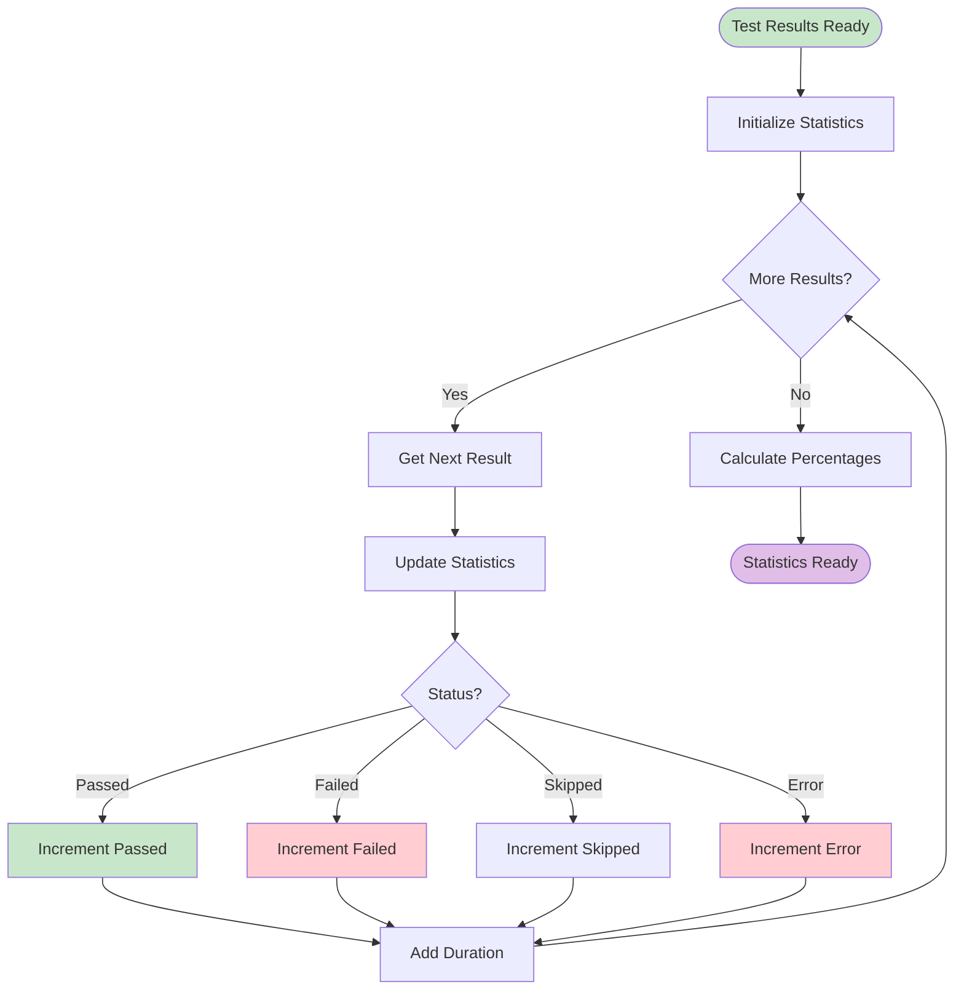

### Statistics Structure

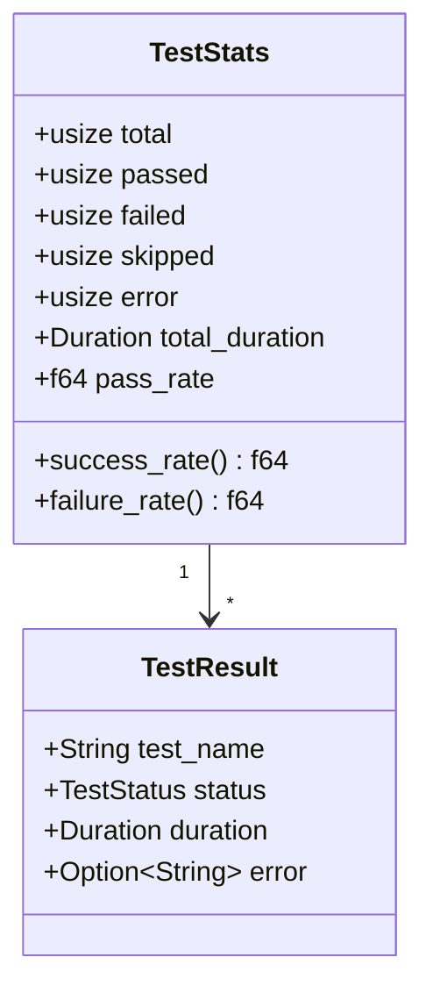

## Error Handling

### Error Recovery Strategy

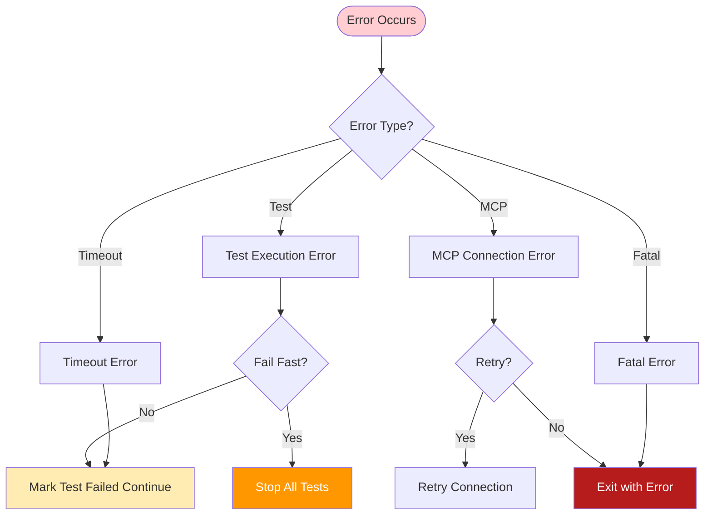

## Exit Code Determination

### Exit Code Logic

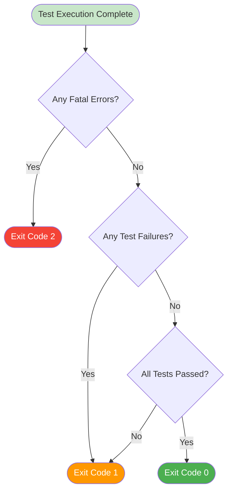

## Performance Optimization

### Parallel Execution Strategy

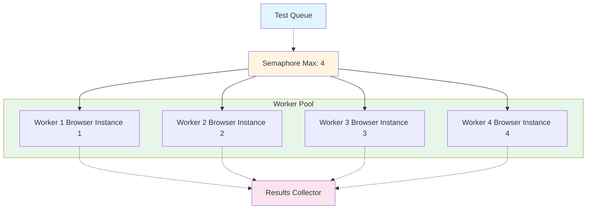

## Configuration

### Runner Configuration

```rust
struct RunnerConfig {
    // Execution mode
    jobs: usize,              // Number of parallel workers
    fail_fast: bool,          // Stop on first failure

    // Timeouts
    test_timeout: Duration,   // Per-test timeout
    total_timeout: Duration,  // Total execution timeout

    // Retry settings
    retry_count: usize,       // Number of retries for failed tests
    retry_delay: Duration,    // Delay between retries
}
```

## Usage Examples

### Basic Usage

```rust
// Create runner with config
let runner = TestRunner::new(config)?;

// Execute tests
let stats = runner.run(PathBuf::from("tests/")).await?;

// Check results
if stats.failed > 0 {
    std::process::exit(1);
}
```

### With Custom Reporter

```rust
let reporter = Box::new(JsonReporter::new());
let mut runner = TestRunner {
    config,
    playwright: PlaywrightClient::connect(&config.playwright)?,
    reporter,
};

let stats = runner.run(test_path).await?;
```

## Related Documentation

- [CLI Interface](CLI-Interface) - Command-line interface
- [Test Loader](Test-Loader) - Test discovery
- [Playwright Client](Playwright-Client) - Browser automation
- [Reporter](Reporter) - Result reporting
- [Architecture](Architecture) - System architecture
- [Sequences](Sequences) - Execution flows

---

**Last Updated:** 2025-11-18
