# Testing Strategy

This document describes the comprehensive testing strategy for ui-test-rs, including unit tests, integration tests, and future end-to-end testing approaches.

## Overview


## Test-Driven Development

### TDD Process

```mermaid
flowchart LR
    Red[🔴 RED<br/>Write Failing Test<br/>Define Behavior]
    Green[🟢 GREEN<br/>Make Test Pass<br/>Minimal Code]
    Refactor[🔵 REFACTOR<br/>Improve Code<br/>Keep Tests Green]

    Red --> Green
    Green --> Refactor
    Refactor -.->|Next Feature| Red

    style Red fill:#ffcdd2
    style Green fill:#c8e6c9
    style Refactor fill:#e1f5ff
```



### TDD Benefits


## Unit Tests

### Unit Test Organization

```mermaid
graph TB
    subgraph SourceFiles["Source Files with Tests"]
        Config[config.rs<br/>#[cfg test] mod tests]
        Loader[loader.rs<br/>#[cfg test] mod tests]
        Runner[runner.rs<br/>#[cfg test] mod tests]
        PW[playwright.rs<br/>#[cfg test] mod tests]
        Reporter[reporter.rs<br/>#[cfg test] mod tests]
    end

    subgraph TestTypes["Unit Test Types"]
        Parse[Config Parsing]
        Discovery[Test Discovery]
        Format[Output Formatting]
        Errors[Error Handling]
    end

    Config --> Parse
    Loader --> Discovery
    Reporter --> Format
    Runner --> Errors

    style SourceFiles fill:#e8f5e9
    style TestTypes fill:#fff9c4
```

### Unit Test Examples

#### Config Parsing Tests

```rust
#[cfg(test)]
mod tests {
    use super::*;

    #[test]
    fn test_config_precedence_cli_over_env() {
        let defaults = Config::default();
        let file_config = None;
        let env = EnvVars::from([("UI_TEST_VERBOSE", "0")]);
        let cli = Cli { verbose: true, ..Default::default() };

        let config = Config::resolve(defaults, file_config, env, &cli);

        assert_eq!(config.verbose, true); // CLI wins
    }

    #[test]
    fn test_config_default_values() {
        let config = Config::default();

        assert_eq!(config.output.format, OutputFormat::Text);
        assert_eq!(config.execution.jobs, 1);
        assert_eq!(config.browser.headless, true);
    }
}
```

#### Test Discovery Tests

```rust
#[cfg(test)]
mod tests {
    use super::*;
    use tempfile::tempdir;

    #[test]
    fn test_discover_tests_with_pattern() {
        let temp = tempdir().unwrap();
        let test_file = temp.path().join("login_test.rs");
        fs::write(&test_file, "// test file").unwrap();

        let loader = TestLoader::new(
            temp.path().to_path_buf(),
            vec!["*_test.rs".to_string()],
        );

        let suites = loader.discover_tests().unwrap();
        assert_eq!(suites.len(), 1);
        assert_eq!(suites[0].file_path, test_file);
    }

    #[test]
    fn test_filter_tests_by_name() {
        let suite = TestSuite {
            name: "login_tests".to_string(),
            file_path: PathBuf::from("login_test.rs"),
            tests: vec![
                TestCase { name: "test_admin_login".to_string(), ..Default::default() },
                TestCase { name: "test_user_login".to_string(), ..Default::default() },
                TestCase { name: "test_logout".to_string(), ..Default::default() },
            ],
        };

        let filtered = filter_tests(vec![suite], "login");
        assert_eq!(filtered[0].tests.len(), 2); // Only login tests
    }
}
```

### Unit Test Coverage


## Integration Tests

### Integration Test Structure


### Integration Test Examples

#### CLI Tests

```rust
use assert_cmd::Command;
use predicates::prelude::*;

#[test]
fn test_cli_help_includes_ai_instructions() {
    let mut cmd = Command::cargo_bin("ui-test-rs").unwrap();

    cmd.arg("--help")
        .assert()
        .success()
        .stdout(predicate::str::contains("AI CODING AGENT INSTRUCTIONS"));
}

#[test]
fn test_cli_version_includes_copyright() {
    let mut cmd = Command::cargo_bin("ui-test-rs").unwrap();

    cmd.arg("--version")
        .assert()
        .success()
        .stdout(predicate::str::contains("Copyright (c) 2025 Michael A Wright"))
        .stdout(predicate::str::contains("License: MIT"));
}

#[test]
fn test_cli_invalid_path_exits_with_error() {
    let mut cmd = Command::cargo_bin("ui-test-rs").unwrap();

    cmd.arg("nonexistent/path")
        .assert()
        .failure()
        .code(2);
}
```

#### End-to-End Tests

```rust
use tempfile::tempdir;
use std::fs;

#[test]
fn test_e2e_discover_and_report() {
    let temp = tempdir().unwrap();

    // Create test file
    let test_file = temp.path().join("example_test.rs");
    fs::write(&test_file, r#"
        #[test]
        fn test_example() {
            assert_eq!(1 + 1, 2);
        }
    "#).unwrap();

    // Run ui-test-rs
    let mut cmd = Command::cargo_bin("ui-test-rs").unwrap();
    cmd.current_dir(temp.path())
        .assert()
        .success()
        .stdout(predicate::str::contains("1 tests, 1 passed, 0 failed"));
}
```

### Integration Test Flow


## Playwright Tests (Future)

### Playwright Test Structure


### Playwright Test Examples

```rust
// Future implementation

#[tokio::test]
async fn test_navigate_to_page() {
    let client = PlaywrightClient::connect(&config).await.unwrap();

    client.navigate("https://example.com").await.unwrap();

    let snapshot = client.snapshot().await.unwrap();
    assert!(snapshot.find_element("heading").is_ok());
}

#[tokio::test]
async fn test_click_button() {
    let client = PlaywrightClient::connect(&config).await.unwrap();

    client.navigate("https://example.com").await.unwrap();
    client.click("button[name='Submit']").await.unwrap();

    // Assert page changed or state updated
}
```

## Test Utilities

### Helper Functions

```rust
// Test utilities module
pub mod test_utils {
    use tempfile::TempDir;
    use std::fs;

    pub fn create_test_file(dir: &TempDir, name: &str, content: &str) -> PathBuf {
        let path = dir.path().join(name);
        fs::write(&path, content).unwrap();
        path
    }

    pub fn create_test_suite(dir: &TempDir) -> Vec<PathBuf> {
        vec![
            create_test_file(dir, "test_1.rs", "// test 1"),
            create_test_file(dir, "test_2.rs", "// test 2"),
        ]
    }
}
```

### Shared Fixtures


## Testing Pyramid

### Test Distribution


### Test Coverage Goals


## Quality Gates

### Pre-Commit Quality Checks

```mermaid
flowchart TB
    Start([Commit Attempt])

    Build{Build<br/>Passes?}
    Test{Tests<br/>Pass?}
    Clippy{Clippy<br/>Clean?}
    Fmt{Formatted?}
    MD{Markdown<br/>Valid?}
    SW{sw-checklist<br/>Passes?}

    Success([✓ Commit Allowed])
    Fail([✗ Fix Issues])

    Start --> Build
    Build -->|Yes| Test
    Build -->|No| Fail

    Test -->|Yes| Clippy
    Test -->|No| Fail

    Clippy -->|Yes| Fmt
    Clippy -->|No| Fail

    Fmt -->|Yes| MD
    Fmt -->|No| Fail

    MD -->|Yes| SW
    MD -->|No| Fail

    SW -->|Yes| Success
    SW -->|No| Fail

    style Start fill:#e1f5ff
    style Success fill:#c8e6c9
    style Fail fill:#ffcdd2
```



### Continuous Integration

```mermaid
sequenceDiagram
    participant Dev
    participant Git
    participant CI
    participant Tests

    Dev->>Git: push commits
    Git->>CI: trigger build

    CI->>CI: ./scripts/build-all.sh
    CI->>Tests: cargo test
    CI->>Tests: cargo clippy
    CI->>Tests: cargo fmt --check
    CI->>Tests: markdown-checker
    CI->>Tests: sw-checklist

    alt All Checks Pass
        Tests-->>CI: ✓ success
        CI-->>Dev: ✓ build passed
    else Any Check Fails
        Tests-->>CI: ✗ failure
        CI-->>Dev: ✗ build failed
    end
```



## Test Execution

### Running Tests

```bash
# All tests
cargo test

# Specific test
cargo test test_config_precedence

# Integration tests only
cargo test --test cli_tests

# With output
cargo test -- --nocapture

# Single-threaded (for debugging)
cargo test -- --test-threads=1
```

### Test Execution Flow


## Performance Testing

### Performance Benchmarks

```rust
// Future: Criterion benchmarks
#[cfg(test)]
mod benchmarks {
    use criterion::{black_box, criterion_group, criterion_main, Criterion};

    fn bench_test_discovery(c: &mut Criterion) {
        c.bench_function("discover_tests", |b| {
            b.iter(|| {
                // Benchmark test discovery
            });
        });
    }

    criterion_group!(benches, bench_test_discovery);
    criterion_main!(benches);
}
```

## Testing Best Practices

### Best Practices


### Arrange-Act-Assert Pattern

```rust
#[test]
fn test_example() {
    // Arrange: Set up test data
    let config = Config::default();
    let input = "test_pattern";

    // Act: Execute the code under test
    let result = process(config, input);

    // Assert: Verify the result
    assert_eq!(result, expected_value);
}
```

## Test Documentation

### Documenting Tests

```rust
/// Tests that configuration precedence follows the correct order:
/// CLI flags > environment variables > config file > defaults
#[test]
fn test_config_precedence() {
    // Test implementation
}

/// Verifies test discovery correctly identifies files matching
/// the *_test.rs pattern while excluding target/ directory
#[test]
fn test_discovery_excludes_target_dir() {
    // Test implementation
}
```

## Related Documentation

- [Development Guide](Development-Guide) - Building and development workflow
- [Architecture](Architecture) - System architecture
- [CLI Interface](CLI-Interface) - Command-line interface
- [Configuration](Configuration) - Configuration system

---

**Last Updated:** 2025-11-18
